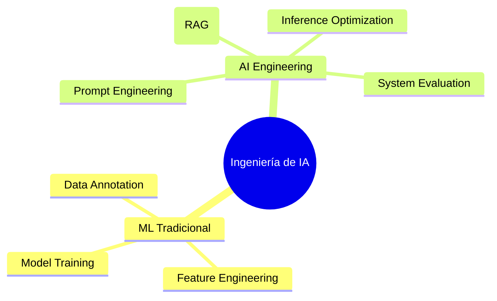

# Capítulo 1: Introducción a la Ingeniería de IA

## 1. Introducción
La Ingeniería de IA (AI Engineering) ha emergido como una disciplina de ingeniería de sistemas dedicada a la adaptación y puesta en producción de modelos de fundamentación (Foundation Models, como LLMs y LMMs). A diferencia de la Ingeniería de Machine Learning (ML) tradicional, que se centraba en el entrenamiento de modelos supervisados desde cero sobre datos tabulares o específicos de la tarea, la Ingeniería de IA se enfoca en componer, evaluar, orquestar y optimizar modelos preentrenados masivos.

## 2. Preguntas Clave
1. ¿Cuál es la diferencia fundamental entre el flujo de trabajo de ML tradicional y la Ingeniería de IA?
2. ¿Cuándo es necesario construir una aplicación de IA y cuándo una solución heurística o de ML tradicional es suficiente?
3. ¿Cómo influyen los costos de inferencia y la latencia en las decisiones iniciales de arquitectura?
4. ¿Qué papel juegan los prototipos rápidos frente a los pipelines de producción robustos?
5. ¿Cuáles son los use-cases emblemáticos que justifican el uso de modelos de fundamentación?

## 3. Desarrollo del Resumen Enriquecido

### ML Tradicional vs. Ingeniería de IA
En ML tradicional, el ciclo de vida se dominaba por la recolección de datos etiquetados, extracción manual o automatizada de características (feature engineering), y el ajuste de hiperparámetros de modelos como XGBoost o CNNs. En la Ingeniería de IA, el modelo preentrenado actúa como un componente de propósito general "off-the-shelf", desplazando la complejidad hacia el diseño de prompts, construcción de contexto (RAG), evaluación continua y orquestación.

> [!example] Metáfora: La CPU de Propósito General
> Un modelo de fundamentación equivale a una CPU moderna. No construyes una CPU personalizada para cada programa; escribes software que instruye a la CPU existente para resolver el problema deseado.

> [!quote] Anécdota: La Explosión Post-ChatGPT
> Chip Huyen destaca que lo sorprendente de ChatGPT no fue únicamente el aumento marginal en las métricas de prueba del modelo (conocido desde AlexNet en 2012), sino el umbral crítico donde la facilidad de uso desbloqueó miles de aplicaciones comerciales simultáneas.

## 4. Análisis Crítico
Chip Huyen advierte contra el "hype" de la IA: implementar LLMs en problemas donde reglas heurísticas simples, expresiones regulares o clasificadores lineales obtendrían el mismo resultado con 1/1000 del costo y latencia determinista de 1ms. La Ingeniería de IA exige rigor pragmático y justificación económica.

## 5. Conclusión
El primer paso en la Ingeniería de IA es evaluar la viabilidad del problema y construir una línea base (baseline) simple antes de escalar la complejidad hacia arquitecturas complejas de RAG o finetuning.
