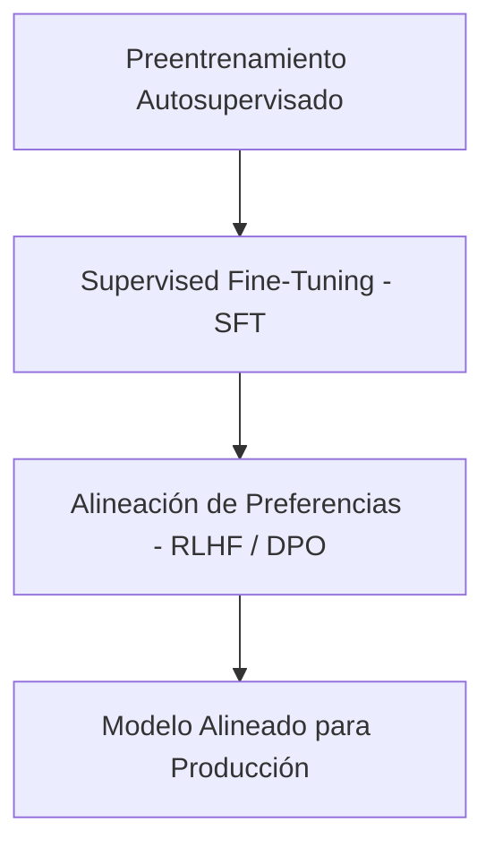

# Capítulo 2: Comprensión de los Modelos de Fundamentación

## 1. Introducción
Para utilizar eficazmente los modelos de fundamentación, es imprescindible comprender cómo se construyen bajo el capó: su arquitectura (Decoder-only Transformer), la receta de datos de preentrenamiento, el escalado, la alineación con preferencias humanas (RLHF/DPO) y los parámetros de generación que gobiernan el decodificado probabilístico.

## 2. Preguntas Clave
1. ¿Cómo influye el tokenizador (BPE/WordPiece) en el comportamiento y costo de un LLM?
2. ¿Cuál es el papel del preentrenamiento autosupervisado frente al post-entrenamiento de alineación (SFT / RLHF / DPO)?
3. ¿Cómo afectan los parámetros sampling (Temperature, Top-p, Top-k, Presence Penalty) la creatividad y factualidad?
4. ¿Qué origina las alucinaciones en modelos autorregresivos?

## 3. Desarrollo del Resumen Enriquecido

### Arquitectura y Alineación (SFT, RLHF, DPO)
Los LLMs son esencialmente predictores del siguiente token. Tras el preentrenamiento en billones de tokens, el modelo pasa por:
1. **Supervised Fine-Tuning (SFT)**: Ajuste en pares Instrucción-Respuesta.
2. **Preference Alignment**: Ajuste con RLHF (Reinforcement Learning from Human Feedback) o DPO (Direct Preference Optimization) para ser útil, honesto e inofensivo (HHH: Helpful, Honest, Harmless).

> [!example] Metáfora: El Motor de Autocompletar Esteroideo
> Un LLM no "piensa" en el sentido humano; calcula distribuciones de probabilidad sobre el siguiente token basándose en los patrones estadísticos aprendidos durante su entrenamiento.

## 4. Análisis Crítico
Las alucinaciones no son errores accidentales, sino una consecuencia intrínseca de la predicción autorregresiva de tokens cuando el modelo se fuerza a responder sobre áreas con baja densidad de probabilidad o datos contradictorios en su dataset de entrenamiento.

## 5. Conclusión
Ajustar los parámetros de generación (como reducir la temperatura a 0.0 para tareas de extracción o elevar el Top-p para creatividad) representa la optimización más rápida y barata antes de alterar el prompt o la arquitectura.
