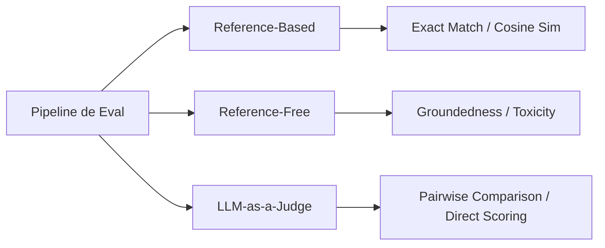

# Capítulo 3: Fundamentos de la Evaluación de IA

## 1. Introducción
La evaluación es considerada por Chip Huyen como el desafío más arduo y decisivo en la Ingeniería de IA. La naturaleza abierta, estocástica y generativa de los LLMs imposibilita el uso exclusivo de pruebas unitarias basadas en coincidencia exacta (exact string match).

## 2. Preguntas Clave
1. ¿Por qué fracasan las métricas tradicionales del NLP (BLEU, ROUGE) en la evaluación de LLMs?
2. ¿Cuáles son los paradigmas de evaluación: Reference-based vs Reference-free?
3. ¿Cómo funciona la técnica LLM-as-a-Judge y qué sesgos presenta?
4. ¿Qué diferencia a un benchmark público (MMLU, GSM8K) de una suite de prueba interna?

## 3. Desarrollo del Resumen Enriquecido

### Paradigmas de Evaluación
- **Reference-based Evaluation**: Compara la respuesta generada con una respuesta humana ideal (Ground Truth). Útil en traducción o resúmenes sintéticos rígidos.
- **Reference-free Evaluation**: Evalúa propiedades intrínsecas de la respuesta (fidelidad al contexto, coherencia, toxicidad, cumplimiento de formato) sin requerir una respuesta de referencia.

> [!quote] Anécdota: El Fallo de los Benchmarks Públicos
> Los benchmarks públicos como MMLU o HumanEval suelen sufrir de "data contamination" (los modelos incluyen las respuestas del test en su preentrenamiento), por lo que un alto score en MMLU rara vez garantiza buen desempeño en el dominio específico de la empresa.

## 4. Análisis Crítico
El paradigma LLM-as-a-Judge es altamente efectivo para acelerar iteraciones, pero requiere calibración continua frente a evaluaciones humanas para mitigar sesgos de egocentrismo y verbosidad.

## 5. Conclusión
Crear un dataset de prueba curado internamente (Test Suite) de 100 a 500 ejemplos reales es el prerequisito indispensable antes de realizar cambios en producción.
