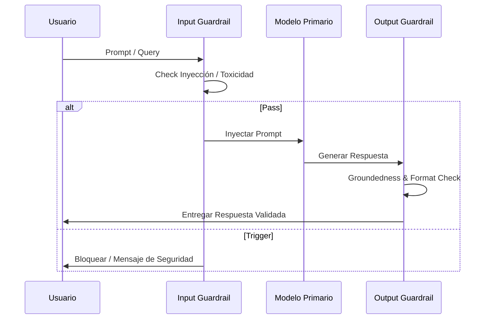

# Capítulo 4: Desarrollo de Pipelines de Evaluación y Guardrails

## 1. Introducción
Este capítulo detalla la implementación práctica de pipelines de evaluación automatizados y guardrails en tiempo real para interceptar respuestas defectuosas o peligrosas antes de llegar al usuario final.

## 2. Preguntas Clave
1. ¿Cómo integrar la evaluación de LLMs dentro del flujo CI/CD?
2. ¿Qué son los Guardrails de Entrada (Input Guardrails) y Salida (Output Guardrails)?
3. ¿Cómo detectar alucinaciones en tiempo real mediante verificaciones de Groundedness?
4. ¿Cómo estructurar el monitoreo continuo en producción?

## 3. Desarrollo del Resumen Enriquecido

### Arquitectura de Guardrails
Un pipeline robusto en producción coloca clasificadores rápidos (SLMs o modelos dedicados) en la entrada y en la salida del modelo de fundamentación.

## 4. Análisis Crítico
Los guardrails agregan latencia y costo de cómputo. La ingeniería debe balancear el riesgo de seguridad frente al presupuesto de latencia de la aplicación.

## 5. Conclusión
Monitorear las métricas en producción mediante muestreo pasivo de conversaciones alimenta directamente el dataset de prueba para la siguiente versión del sistema.
