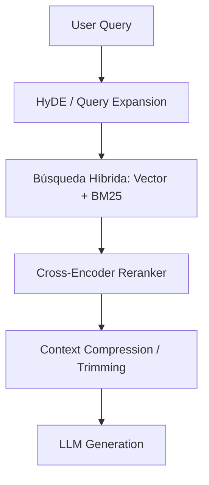

# Capítulo 6: Construcción de Contexto: RAG y Patrones Agénticos

## 1. Introducción
Debido a las limitaciones de la memoria paramétrica de los modelos y al costo de ventanas de contexto gigantes, la construcción inteligente del contexto a través de RAG (Retrieval-Augmented Generation) y patrones agénticos es el pilar central del desarrollo moderno de aplicaciones de IA.

## 2. Preguntas Clave
1. ¿Por qué funciona RAG y cuáles son sus fases principales (Ingesta, Recuperación, Reordenamiento, Generación)?
2. ¿Qué estrategias existen para la segmentación de documentos (Chunking)?
3. ¿Cómo combinar la Búsqueda por Vectores (Dense Retrieval) con Búsqueda Léxica (Sparse BM25) mediante Híbrido + Reranking?
4. ¿Qué define a un Agente de IA y cómo se diferencia de una tubería RAG determinista?

## 3. Desarrollo del Resumen Enriquecido

### RAG Tradicional vs RAG Avanzado

> [!example] Metáfora: El Examen a Libro Abierto
> Un LLM sin RAG intenta responder el examen recordando todo lo que leyó en la universidad (memoria paramétrica). Un LLM con RAG busca exactamente la página relevante del manual antes de redactar la respuesta.

### Patrones Agénticos
Un agente extiende RAG al permitir planificación (Planning), uso dinámico de herramientas (Tool Calling) y bucles de razonamiento (ReAct / Plan-and-Solve).

## 4. Análisis Crítico
Aunque los sistemas agénticos son extremadamente potentes, su no-determinismo y la acumulación de errores en bucles multi-paso los hace propensos a fallas en producción. Chip Huyen recomienda restringir la autonomía agéntica mediante grafos de estados rígidos (como LangGraph o autómata finito).

## 5. Conclusión
Optimizar la recuperación (mediante chunking semántico y reranking) resuelve más del 80% de las alucinaciones observadas en aplicaciones corporativas sin necesidad de entrenar o ajustar modelos.
