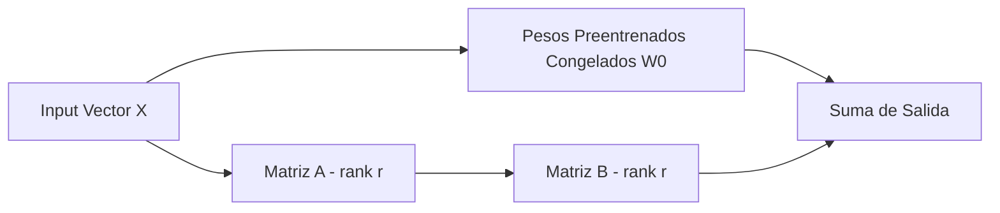

# Capítulo 7: Adaptación de Modelos mediante Finetuning (PEFT, LoRA)

## 1. Introducción
Cuando el prompt engineering y RAG no son suficientes para adaptar la sintaxis, estilo o razonamiento especializado de un modelo, el finetuning permite modificar directamente los pesos. Debido al consumo masivo de memoria VRAM, las técnicas de PEFT (Parameter-Efficient Fine-Tuning) dominan la práctica industrial.

## 2. Preguntas Clave
1. ¿Cuándo se debe hacer finetuning y cuándo es un error estratégico?
2. ¿Cómo funciona LoRA (Low-Rank Adaptation) y QLoRA?
3. ¿Cómo calcular el footprint de memoria VRAM para entrenamiento vs inferencia?
4. ¿Qué es Model Merging y cómo combinar modelos adaptados sin reentrenar?

## 3. Desarrollo del Resumen Enriquecido

### Cálculo de Memoria VRAM en Finetuning
Para un modelo de $P$ billones de parámetros en FP16:
- Pesos del modelo: $2P$ GB
- Gradientes: $2P$ GB
- Estados del Optimizador (AdamW): $8P$ GB
- Activaciones y memoria temporal.

> [!tip] LoRA al Rescate
> LoRA reduce los parámetros entrenables al descomponer $\Delta W = B \cdot A$ donde $A \in \mathbb{R}^{r \times k}$ y $B \in \mathbb{R}^{d \times r}$ con rango $r \ll \min(d,k)$.

## 4. Análisis Crítico
El finetuning NO es la solución primaria para inyectar nuevo conocimiento fáctico (los modelos tienden a sufrir catastrophic forgetting o seguir alucinando hechos específicos). RAG es superior para hechos; Finetuning es superior para comportamientos y formatos.

## 5. Conclusión
Combinar un modelo pequeño finetuned en estilo con una capa RAG para factualidad proporciona el mejor balance de rendimiento, latencia y costo.
