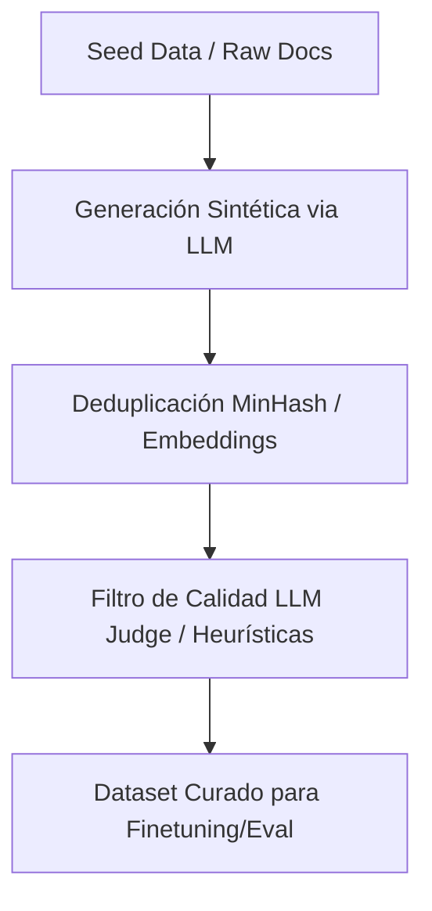

# Capítulo 8: Ingeniería de Datos para IA y Generación Sintética

## 1. Introducción
"Data is the leverage of AI". El éxito de cualquier pipeline de evaluación, RAG o finetuning depende de la calidad, diversidad y limpieza de los datasets recopilados y generados sintéticamente.

## 2. Preguntas Clave
1. ¿Cómo recopilar y filtrar datos de alta calidad para finetuning y evaluación?
2. ¿Cómo funciona la generación de datos sintéticos (Synthetic Data Generation) guiada por LLMs potentes?
3. ¿Cómo validar y curar automáticamente datasets sintéticos para evitar la degradación del modelo (Model Collapse)?
4. ¿Cuáles son los dilemas éticos, de privacidad y licencias asociadas a los datos de IA?

## 3. Desarrollo del Resumen Enriquecido

### Generación Sintética y Filtrado
Para superar la escasez de datos etiquetados manualmente, la generación sintética aprovecha modelos SOTA (como Claude 3.5 Sonnet o GPT-4o) para generar instrucciones, preguntas y respuestas, seguidas de filtros estricto de deduplicación y calidad.

## 4. Análisis Crítico
Entrenar modelos recursivamente sobre datos sintéticos no filtrados conduce a "Model Collapse", donde la distribución del modelo se contrae perdiendo variabilidad y riqueza en los extremos.

## 5. Conclusión
Un dataset pequeño de 1,000 ejemplos minuciosamente curados y verificados por expertos humanos supera habitualmente a 100,000 ejemplos ruidosos o sintéticos sin filtrar.
