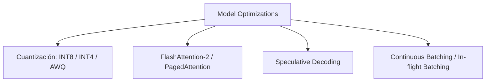

# Capítulo 9: Optimización de Modelos para Inferencia

## 1. Introducción
Desplegar modelos de fundamentación a escala requiere reducir los costos de infraestructura (VRAM/GPU) y minimizar la latencia de respuesta (Time to First Token - TTFT y Inter-Token Latency - ITL). Este capítulo aborda optimizaciones tanto a nivel de modelo como de servicio.

## 2. Preguntas Clave
1. ¿Qué es la cuantización (INT8, INT4, FP8, AWQ, GPTQ) y cómo afecta el rendimiento?
2. ¿Cómo funciona la optimización de atención con FlashAttention y KV Cache PagedAttention (vLLM)?
3. ¿En qué consiste el Speculative Decoding y cuándo proporciona aceleración efectiva?
4. ¿Cuáles son las diferencias operativas entre usar APIs propietarias (OpenAI/Anthropic) y auto-hospedar modelos open source (vLLM/TGI)?

## 3. Desarrollo del Resumen Enriquecido

### Técnicas de Optimización de Inferencia
- **Cuantización**: Convierte los pesos de FP16/BF16 a INT8 o INT4, reduciendo la memoria en 2x-4x y acelerando las operaciones de lectura de memoria.
- **PagedAttention / KV Caching**: Organiza la memoria de claves y valores en páginas no contiguas (similar a la memoria virtual de un SO), reduciendo la fragmentación de VRAM en más de un 60%.
- **Speculative Decoding**: Un modelo pequeño propone $K$ tokens en paralelo que son verificados simultáneamente por el modelo grande en una sola pasada forward.

## 4. Análisis Crítico
Auto-hospedar modelos ofrece privacidad y costos fijos previsibles a alto volumen, pero exige experiencia técnica dedicada a mantener clusters de GPUs, parches de inferencia y failover. Las APIs administradas siguen siendo la opción óptima para volumen bajo o medio.

## 5. Conclusión
Implementar Continuous Batching y PagedAttention en servidores de inferencia modernos (como vLLM o TensorRT-LLM) aumenta el throughput de solicitudes en hasta 5x sin alterar la calidad del modelo.
