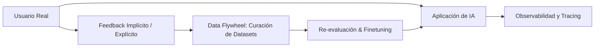

# Capítulo 10: Construcción de Aplicaciones de IA End-to-End y Bucles de Feedback

## 1. Introducción
El capítulo final integra todos los componentes del libro —evaluación, prompts, RAG, agentes, finetuning, datos y optimización— en un ciclo continuo de desarrollo de software y diseño centrado en el usuario.

## 2. Preguntas Clave
1. ¿Cómo conectar los componentes en una arquitectura integrada de producción?
2. ¿Cómo diseñar mecanismos de feedback de usuario (implícitos y explícitos) que no degraden la experiencia de usuario (UX)?
3. ¿Cómo gestionar la observabilidad, la trazabilidad de consultas (Tracing) y la gestión de costos en tiempo real?
4. ¿Cuáles son las mejores prácticas para la evolución continua de la aplicación?

## 3. Desarrollo del Resumen Enriquecido

### El Bucle de Retroalimentación de Producción
Las interacciones de los usuarios reales producen señales invaluables. 
- **Feedback Explícito**: Thumbs up/down, calificaciones de 1-5 estrellas, correcciones manuales.
- **Feedback Implicito**: Copiar al portapapeles, tiempo de permanencia, falta de regeneración de respuestas, conversiones de compra.

## 4. Análisis Crítico
El feedback explícito (thumbs up/down) sufre de un índice de participación menor al 1%. Los ingenieros de IA deben basarse primordialmente en señales implícitas de comportamiento agregadas para detectar degradaciones o patrones fallidos.

## 5. Conclusión
La Ingeniería de IA no concluye con el despliegue del modelo; el despliegue es únicamente el inicio del ciclo de aprendizaje continuo donde los datos reales refinan constantemente el sistema.
