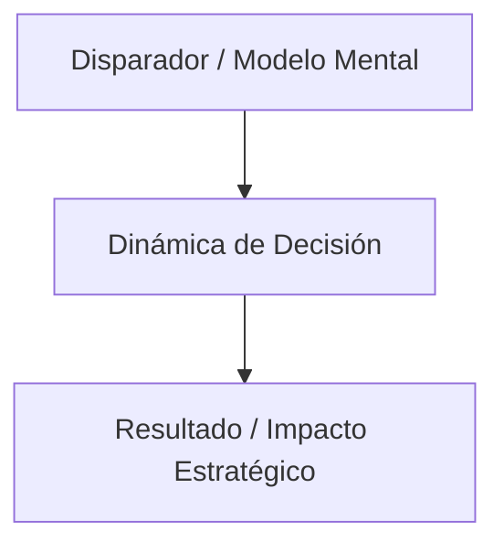

# Non-Fiction Book Curator & Synthesizer (okc-bookSummary) — High-Density Actionable Synthesis (HDAS)

Transforms knowledge from non-fiction books and long documents into **rich, actionable, and deeply analytical chapter-by-chapter summaries** directly inside the Obsidian Vault (`VAULT_ROOT`), combining continuous narrative depth with active learning, strategic mental models, and immediate real-world application.

---

## 🎯 Primary Execution Rules

1. **Default Upload to Obsidian (`VAULT_ROOT`)**: All processed content (master book note, individual chapter notes, images in `assets/images/`, `#flashcard` cards, glossary, `wiki/` concepts, and Master Plan updates) **MUST be written exclusively and by default to the Obsidian Vault** (`VAULT_ROOT`).
2. **Sequential Chapter-by-Chapter Processing**:
   - **Step 1**: Ingest and segment the book using `uv run python scripts/fetch_book_data.py --input <file> --slug <slug>`.
   - **Step 2**: Process and write **each chapter individually and sequentially** (`Chapter 00 — <Title>.md`, `Chapter 01 — <Title>.md`, ...) inside the book subfolder.
   - **Step 3**: Generate the **Executive Master Book Note** (`<Author> — <Book Title>.md`) in the root of `Books/` linking all individual chapters.
3. **High-Density Actionable Synthesis (HDAS Standard)**:
   - **Dense Narrative Prose**: Articulated explanatory paragraphs explaining cause, effect, and dynamics.
   - **Front-Loaded Insights**: Core mental models named and bolded (e.g. `Insight 1: [Mental Model Name]`).
   - **Actionable Tooling (The "How")**: Concrete step-by-step implementation, a 15-minute challenge, and a self-reflection prompt per chapter.
   - **Smart Commentary**: Cross-domain synthesis connecting the chapter's thesis to other authoritative works and mental models.
   - **Common Pitfalls (`[!warning]`)**: Explicit warnings about common misapplications or biases.
4. **Mandatory Diagrams and Visual Assets**:
   - Embed extracted images/figures from the source document using `![[assets/images/<slug>-img-X.png]]`.
   - Reconstruct conceptual maps, architectures, and decision workflows using **native Mermaid.js diagrams**.
5. **Automatic Cleanup of Staging Files**:
   - Upon completion, purge temporary staging files by running `uv run python scripts/fetch_book_data.py --clean`.
6. **Vault Synchronization**:
   - Run `uv run python scripts/sync_vault.py` to rebuild Master Plans, update Graphify, and run the vault linter.

---

## 🎯 File Architecture in Obsidian (`VAULT_ROOT`)

Each processed book generates the following directory structure inside the Vault:

```
VAULT_ROOT/dataScienceKnowledgeBase/<Category>/raw/books/
├── <Author> — <Book Title>.md       # Executive Master Note (Synopsis, Architecture Map, Index, Flashcards, Glossary)
└── <Author> — <Book Title>/
    ├── Chapter 00 — <Title>.md      # Individual Chapter Note (HDAS Standard)
    ├── Chapter 01 — <Title>.md
    └── ...
```

---

## 📋 Standard Chapter Architecture (`Chapter XX — <Title>.md`)

Each chapter note must contain the following 7 structured sections:

```markdown
# Chapter XX — <Título del Capítulo>

> **<Autor> — <Título del Libro>**
> Source: Book / Audio Ingestion · Date: YYYY
> Part of: [[<Autor> — <Título del Libro>]]
> Type: book-chapter
> Processed: DD-MM-YYYY
> Tags: #no-read-yet #book-summary #actionable-insights #mental-models

### 1. Tesis Central & Insight en Una Frase
*La gran epifanía del capítulo sintetizada con impacto inmediato.*
Contexto narrativo de cómo este bloque se integra en la tesis global del autor.

### 2. Preguntas de Indagación
1. ¿Pregunta crítica 1...?
2. ¿Pregunta crítica 2...?
3. ¿Pregunta crítica 3...?
4. ¿Pregunta crítica 4...?
5. ¿Pregunta crítica 5...?

### 3. Desarrollo del Resumen Enriquecido (Profundidad Narrativa & Modelos Mentales)
Párrafos articulados y densos (sin listas secas de viñetas) que explican causas, dinámicas y consecuencias:
- **Insight 1: [Nombre del Modelo Mental / Mecanismo Clave]**
  Desarrollo profundo de la lógica, datos empíricos y matices históricos.
- **Insight 2: [Nombre del Modelo Mental / Mecanismo Clave]**
  Explicación de la operativa y los factores determinantes.
- **Insight 3: [Nombre del Modelo Mental / Mecanismo Clave]**
  Implicaciones estratégicas y transformaciones en la industria.

> [!example] Metáfora Visual / Analogía: <Título>
> La analogía o historia emblemática del autor para fijar el concepto en la memoria.

> [!quote] Cita Clave & Caso Real: <Título>
> Caso de estudio real con su lección fundamental.

> [!warning] Trampa Común & Sesgo a Evitar: <Título>
> El error típico que se comete al interpretar o aplicar erróneamente este principio.



### 4. Smart Commentary (Conexiones Cruzadas & Contexto Ampliado)
Análisis de alto nivel que conecta la tesis del capítulo con otros autores, libros referentes (ej. *The Second Machine Age*, *Superintelligence*, *Homo Deus*, *Blitzscaling*, *Lean Startup*) o avances tecnológicos contemporáneos.

### 5. Guía de Aplicación Práctica (El "Cómo")
* **Paso a Paso Accionable:** 3 a 4 pasos específicos para implementar el concepto en el trabajo, proyectos o toma de decisiones.
* **Reto Inmediato de 15 Minutos:** Ejercicio práctico para ejecutar hoy mismo.
* **Pregunta de Autorreflexión:** Pregunta introspectiva para auditar tu propia situación.

### 6. Análisis Crítico & Límites del Modelo
Evaluación honesta de sesgos del autor, excepciones donde la regla no aplica y contraargumentos del campo.

### 7. Takeaway Ejecutivo en Una Frase
*La conclusión definitiva y accionable para recordar siempre.*
```

---

## 📖 Executive Master Note Structure (`<Author> — <Book Title>.md`)

The Master Note serves as the central hub for the book at the root of `raw/books/`:

```markdown
# <Book Title>

> **<Author> — <Book Title>**
> Type: book | non-fiction
> Processed: DD-MM-YYYY
> Status: [[Chapter 00 — <Title>]], [[Chapter 01 — <Title>]] ...
> Tags: #no-read-yet #book-summary #master-note

## 📌 Executive Synopsis
(Fluid summary of 300-500 words covering the core thesis of the book, the problems it addresses, and the value of reading it).

## 🗺️ Book Architecture Map
```mermaid
mindmap
  root((<Book Title>))
    Parte 1: Fundamentos
      [[Chapter 00 — <Title>]]
      [[Chapter 01 — <Title>]]
    Parte 2: Mecánica y Dinámicas
      [[Chapter 02 — <Title>]]
```

## 📚 Chapter Index & Mental Models
| Chapter | Title | Mental Models & Key Concepts | Link |
| :--- | :--- | :--- | :--- |
| Ch. 00 | <Title> | [[ConceptA]], [[ConceptB]] | [[Chapter 00 — <Title>]] |
| Ch. 01 | <Title> | [[ConceptC]] | [[Chapter 01 — <Title>]] |

## 🎴 Study Flashcards (#flashcard)
#flashcard
Q: What is the central thesis advocated by the author in the book?
A: Concise and precise answer.

Q: How does concept X connect to principle Y?
A: Dynamics explanation.

## 📖 Specialized Glossary
**Term**: Detailed definition in the context of the book.

## 🔗 Related Wiki Concepts
- [[ConceptA]]
- [[ConceptB]]
```

---

## 🚀 Execution & Integration Workflow

1. **Ingest and Segment**: Begin with `uv run python scripts/fetch_book_data.py --input <file> --slug <slug>`.
2. **Sequential Chapter Generation**: Create each `Chapter XX — <Title>.md` note sequentially in `raw/books/<Author> — <Book Title>/` using the 7-section HDAS standard.
3. **Master Note Creation**: Create `<Author> — <Book Title>.md` in the root of `raw/books/`.
4. **Wiki Enrichment**: Create or update concept pages in `wiki/` with bidirectional wikilinks.
5. **Staging Cleanup**: Run `uv run python scripts/fetch_book_data.py --clean`.
6. **Vault Sync**: Run `uv run python scripts/sync_vault.py`.
