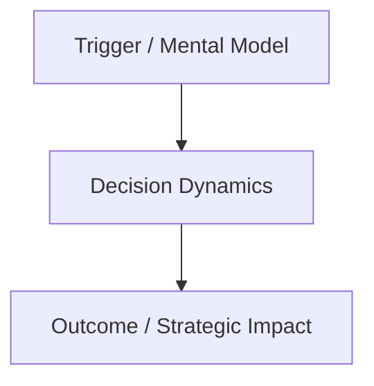

# Non-Fiction Book Curator & Synthesizer (okc-bookSummary) — High-Density Actionable Synthesis (HDAS)

Transforms knowledge from non-fiction books and long documents into **rich, actionable, and deeply analytical chapter-by-chapter summaries** directly inside the Obsidian Vault (`VAULT_ROOT`), combining continuous narrative depth with active learning, strategic mental models, and immediate real-world application.

---

## 🎯 Primary Execution Rules

1. **Default Upload to Obsidian (`VAULT_ROOT`)**: All processed content (master book note, individual chapter notes, images in `assets/images/`, `#flashcard` cards, glossary, `wiki/` concepts, and Master Plan updates) **MUST be written exclusively and by default to the Obsidian Vault** (`VAULT_ROOT`).
2. **Sequential Chapter-by-Chapter Processing**:
   - **Step 1**: Ingest and segment the book using `uv run python scripts/fetch_book_data.py --input <file> --slug <slug>`.
   - **Step 2**: Process and write **each chapter individually and sequentially** (`Chapter 00 — <Title>.md`, `Chapter 01 — <Title>.md`, ...) inside the book subfolder.
   - **Step 3**: Generate the **Executive Master Book Note** (`<Author> — <Book Title>.md`) in the root of `Books/` linking all individual chapters.
3. **High-Density Actionable Synthesis (HDAS Standard)**:
   - **Dense Narrative Prose**: Articulated explanatory paragraphs explaining cause, effect, and dynamics.
   - **Front-Loaded Insights**: Core mental models named and bolded (e.g. `Insight 1: [Mental Model Name]`).
   - **Actionable Tooling (The "How")**: Concrete step-by-step implementation, a 15-minute challenge, and a self-reflection prompt per chapter.
   - **Smart Commentary**: Cross-domain synthesis connecting the chapter's thesis to other authoritative works and mental models.
   - **Common Pitfalls (`[!warning]`)**: Explicit warnings about common misapplications or biases.
4. **Mandatory Diagrams and Visual Assets**:
   - Embed extracted images/figures from the source document using `![[assets/images/<slug>-img-X.png]]`.
   - Reconstruct conceptual maps, architectures, and decision workflows using **native Mermaid.js diagrams**.
5. **Automatic Cleanup of Staging Files**:
   - Upon completion, purge temporary staging files by running `uv run python scripts/fetch_book_data.py --clean`.
6. **Vault Synchronization**:
   - Run `uv run python scripts/sync_vault.py` to rebuild Master Plans, update Graphify, and run the vault linter.

---

## 🎯 File Architecture in Obsidian (`VAULT_ROOT`)

Each processed book generates the following directory structure inside the Vault:

```
VAULT_ROOT/dataScienceKnowledgeBase/<Category>/raw/books/
├── <Author> — <Book Title>.md       # Executive Master Note (Synopsis, Architecture Map, Index, Flashcards, Glossary)
└── <Author> — <Book Title>/
    ├── Chapter 00 — <Title>.md      # Individual Chapter Note (HDAS Standard)
    ├── Chapter 01 — <Title>.md
    └── ...
```

---

## 📋 Standard Chapter Architecture (`Chapter XX — <Title>.md`)

Each chapter note must contain the following 7 structured sections:

```markdown
# Chapter XX — <Chapter Title>

> **<Author> — <Book Title>**
> Source: Book / Audio Ingestion · Date: YYYY
> Part of: [[<Author> — <Book Title>]]
> Type: book-chapter
> Processed: DD-MM-YYYY
> Tags: #no-read-yet #book-summary #actionable-insights #mental-models

### 1. Central Thesis & One-Sentence Insight
*The major epiphany of the chapter synthesized with immediate impact.*
Narrative context of how this section integrates into the author's overarching thesis.

### 2. Inquiry Questions
1. Critical question 1...?
2. Critical question 2...?
3. Critical question 3...?
4. Critical question 4...?
5. Critical question 5...?

### 3. Enriched Summary Development (Narrative Depth & Mental Models)
Dense and articulated paragraphs (avoid dry bullet lists) explaining root causes, dynamics, and consequences:
- **Insight 1: [Name of Mental Model / Core Mechanism]**
  In-depth explanation of logic, empirical evidence, and historical nuances.
- **Insight 2: [Name of Mental Model / Core Mechanism]**
  Operational mechanics and determining factors.
- **Insight 3: [Name of Mental Model / Core Mechanism]**
  Strategic implications and industry transformations.

> [!example] Visual Metaphor / Analogy: <Title>
> The author's signature analogy or illustrative story to anchor the concept in memory.

> [!quote] Key Quote & Real-World Case: <Title>
> Real-world case study with its foundational lesson.

> [!warning] Common Pitfall & Bias to Avoid: <Title>
> The typical mistake or trap encountered when erroneously interpreting or applying this principle.



### 4. Smart Commentary (Cross-Domain Connections & Extended Context)
High-level analysis connecting the chapter's thesis to other authors, foundational books (e.g., *The Second Machine Age*, *Superintelligence*, *Homo Deus*, *Blitzscaling*, *Lean Startup*), or contemporary technological developments.

### 5. Practical Application Guide (The "How")
* **Actionable Step-by-Step:** 3 to 4 specific steps to implement the concept at work, in engineering projects, or in decision-making.
* **Immediate 15-Minute Challenge:** Practical hands-on exercise to execute today.
* **Self-Reflection Prompt:** Introspective inquiry to audit your current workflow or architecture.

### 6. Critical Analysis & Model Boundaries
Honest evaluation of author biases, edge-case exceptions where the model fails, and counterarguments from the field.

### 7. Executive One-Sentence Takeaway
*The definitive actionable conclusion to remember always.*
```

---

## 📖 Executive Master Note Structure (`<Author> — <Book Title>.md`)

The Master Note serves as the central hub for the book at the root of `raw/books/`:

```markdown
# <Book Title>

> **<Author> — <Book Title>**
> Type: book | non-fiction
> Processed: DD-MM-YYYY
> Status: [[Chapter 00 — <Title>]], [[Chapter 01 — <Title>]] ...
> Tags: #no-read-yet #book-summary #master-note

## 📌 Executive Synopsis
(Fluid summary of 300-500 words covering the core thesis of the book, the problems it addresses, and the value of reading it).

## 🗺️ Book Architecture Map
```mermaid
mindmap
  root((<Book Title>))
    Part 1: Foundations
      [[Chapter 00 — <Title>]]
      [[Chapter 01 — <Title>]]
    Part 2: Mechanics and Dynamics
      [[Chapter 02 — <Title>]]
```

## 📚 Chapter Index & Mental Models
| Chapter | Title | Mental Models & Key Concepts | Link |
| :--- | :--- | :--- | :--- |
| Ch. 00 | <Title> | [[ConceptA]], [[ConceptB]] | [[Chapter 00 — <Title>]] |
| Ch. 01 | <Title> | [[ConceptC]] | [[Chapter 01 — <Title>]] |

## 🎴 Study Flashcards (#flashcard)
#flashcard
Q: What is the central thesis advocated by the author in the book?
A: Concise and precise answer.

Q: How does concept X connect to principle Y?
A: Dynamics explanation.

## 📖 Specialized Glossary
**Term**: Detailed definition in the context of the book.

## 🔗 Related Wiki Concepts
- [[ConceptA]]
- [[ConceptB]]
```

---

## 🚀 Execution & Integration Workflow

1. **Ingest and Segment**: Begin with `uv run python scripts/fetch_book_data.py --input <file> --slug <slug>`.
2. **Sequential Chapter Generation**: Create each `Chapter XX — <Title>.md` note sequentially in `raw/books/<Author> — <Book Title>/` using the 7-section HDAS standard.
3. **Master Note Creation**: Create `<Author> — <Book Title>.md` in the root of `raw/books/`.
4. **Wiki Enrichment**: Create or update concept pages in `wiki/` with bidirectional wikilinks.
5. **Staging Cleanup**: Run `uv run python scripts/fetch_book_data.py --clean`.
6. **Vault Sync**: Run `uv run python scripts/sync_vault.py`.
