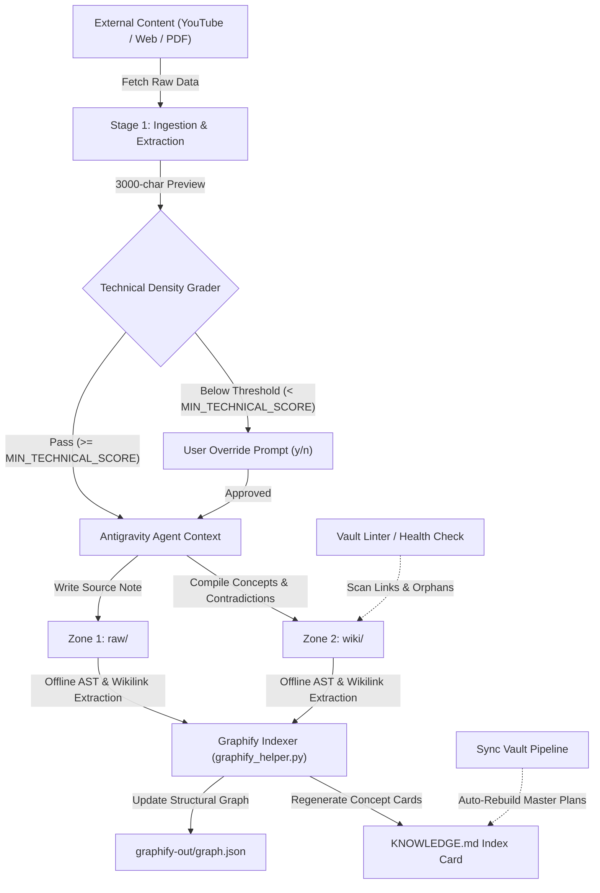

# Obsidian Knowledge Curator — Antigravity 2.0

<p align="center">
  
</p>


An autonomous, agentic knowledge compiler designed to maintain and synthesize a "Second Brain" within an Obsidian Vault. Built natively with the **Google Antigravity SDK** and **Gemini 3.1 Pro**, this system automates the ingestion of technical articles, YouTube videos, and research papers, filtering content via an automated **Technical Density Grader**, indexing structural relationships via **Graphify.net**, and maintaining a decoupled skill-data architecture.

---

## 📖 Table of Contents
- [Project Overview](#-project-overview)
- [Problem Statement](#-problem-statement)
- [Key Architectural Innovations](#-key-architectural-innovations)
- [System Architecture](#-system-architecture)
- [Getting Started & Agent Installation](#-getting-started--agent-installation)
- [The "Zone" Knowledge Architecture](#-the-zone-knowledge-architecture)
- [End-to-End Workflow](#-end-to-end-workflow)
- [AI & Agent Components](#-ai--agent-components)
- [Security & Sandboxing](#-security--sandboxing)
- [Technology Stack](#-technology-stack)
- [Future Improvements & Lessons Learned](#-future-improvements--lessons-learned)

---

## 🎯 Project Overview

This project serves as an advanced production implementation of the **LLM Wiki Paradigm** (inspired by Andrej Karpathy's concept of LLMs as knowledge compilers rather than simple chatbots). 

Instead of treating the AI as a search engine over raw documents (like traditional RAG), the **Obsidian Knowledge Curator** acts as an active maintainer of a local filesystem database. It reads raw inputs, grades source density, extracts core concepts, updates existing Wiki pages, flags contradictions natively, and builds a chronological trace of evolving ideas across thousands of notes.

---

## 🧠 Problem Statement

**The Engineering Challenge:** 
Knowledge workers and AI Engineers consume vast amounts of technical content (papers, documentation, videos). Traditional PKM (Personal Knowledge Management) systems rely on manual synthesis, while modern LLM chatbots (chat-with-PDF) fail to compound knowledge over time because they lack persistent state and cross-document reasoning. Furthermore, naive LLM graph compilation introduces massive API token costs and high query latencies.

**The Solution:** 
A headless, zero-token-overhead automation pipeline that ingests content, parses transcripts, evaluates technical density, and uses an **Offline AST Graphify Indexer** to map vault relationships without external LLM API costs.

---

## 💡 Key Architectural Innovations

### 1. Technical Density Ingestion Grader (`MIN_TECHNICAL_SCORE`)
Before any source (YouTube video, Web article, Tweet) is written to the vault, a 3,000-character preview is evaluated across three dimensions:
- **Information Density** (lack of fluff, factual saturation).
- **Provenance & References** (citations, data points, verified authors).
- **Technical Level** (code architecture relevance, concrete implementations).

If the composite score falls below `MIN_TECHNICAL_SCORE` (configured in `.env`, default: `60`), ingestion halts, presenting a detailed scorecard and summary to the user for explicit override confirmation.

### 2. Zero-Cost Offline Graphify Indexing & Hybrid Mapper (`graphify_mapper.py`)
To enable graph-aware context retrieval across 13,000+ notes without incurring API costs or latency penalties:
- **AST & Wikilink Parser**: Uses local Python regex and Markdown AST parsing to extract document headings, parent-child nesting, and `[[wikilinks]]`.
- **Hybrid Local Context Engine (`GraphifyMapper`)**: Pre-predicts target `raw/` categories and matches existing `wiki/` concepts (<50ms latency, $0.00 token cost) directly from `graphify-out/graph.json`. It falls back to lightweight LLM queries only if local graph matching confidence drops below 70%.
- **Injected Ingestion Context**: Automatically injects `"graphify_context"` objects into `temp/fetched_data.json` across all ingestion scripts (`fetch_article_data.py`, `fetch_youtube_data.py`, `fetch_twitter_data.py`, `fetch_book_data.py`).
- **dswok Integration**: Indexes protected external knowledge directories (`dataScienceKnowledgeBase/dswok`) as a read-only information graph without modifying any files within them.

### 3. Podcast & Audio Ingestion Pipeline (`/okc-urlPodcast` & `fetch_podcast_data.py`)
- **Multi-Platform Support**: Ingests podcasts from Siemens.FM, Spotify, Apple Podcasts, RSS feeds, YouTube audio, and direct `.mp3`/`.m4a` files using `yt-dlp` and `curl`.
- **Offline Whisper Transcription**: Uses local **Buzz CLI** (`/Applications/Buzz.app/Contents/MacOS/Buzz`) to transcribe audio tracks offline without external API costs.

### 4. 3-Tier Scraping Fallbacks & Audio Auto-Detection (`fetch_article_data.py`)
- **Audio Redirection**: Automatically detects podcast/audio URLs or HTML `og:audio` tags and delegates execution to `fetch_podcast_data.py`.
- **Tier 1 (Fast Extraction)**: Uses `mcp-server-fetch` or `trafilatura`.
- **Tier 2 (Browser User-Agent & SSL Bypass)**: Automatically escalates to DOM parsing with custom User-Agents and SSL verification bypass when encountering paywalls, captchas, LinkedIn, or Medium restrictions.
- **Tier 3 (Web Search Fallback)**: Uses `search_web` to compile verified summaries if a page is 100% inaccessible.

### 5. Mandatory Local Image Preservation Engine (`fetch_article_data.py` & `fetch_book_data.py`)
- **Automated Asset Extraction**: Automatically parses image URLs from web articles (HTML `` tags, markdown ``, Medium `miro.medium.com`, etc.) and books during processing.
- **Local Download & Offline Self-Containment**: Downloads remote images directly into `<VAULT_ROOT>/assets/images/<slug>-img-<idx>.<ext>` via HTTP/SSL-bypass, eliminating fragile external link dependencies.
- **Native Obsidian Wikilink Embeddings**: Replaces remote image links with native wikilink syntax `![[assets/images/<file>.png]]`, ensuring 100% offline readability and graph visual consistency.

### 6. Decoupled Skill Factory (`SKILL.md` vs `KNOWLEDGE.md`)
To prevent system prompt inflation and context degradation:
- **Behavior Prompt (`SKILL.md`)**: Contains pure agent execution rules, wikilink mandates, and non-hallucination constraints.
- **Compiled Static Database (`KNOWLEDGE.md`)**: An automatically regenerated index containing ~575+ concept cards with absolute file links across the vault.

---

## 🏗 System Architecture



---

## 🚀 Getting Started & Agent Installation

### 1. System Requirements

This project runs locally and relies on Python 3.12+ and external command-line utilities.

*   **Python Package Manager:** [uv](https://github.com/astral-sh/uv) (required for high-speed, isolated environment management).
*   **Browser Scraping:** [Google Chrome](https://www.google.com/chrome/) or Chrome Canary (installed locally, required for dynamic CDP JS rendering).
*   **Media Processing:** [ffmpeg](https://ffmpeg.org/) (required by `yt-dlp` to extract audio streams).
*   **Local Transcription Fallback:** [Buzz CLI](https://github.com/chidiwilliams/buzz) (required for offline Whisper transcription fallback).

---

### 2. Installation Steps

#### Step 1: Install OS Prerequisites

**macOS (via Homebrew):**
```bash
# Install uv and ffmpeg
brew install uv ffmpeg

# Install Buzz (GUI + CLI)
brew install --cask buzz

# Install Graphify CLI
uv tool install "graphifyy[gemini]"
```

**Linux (Ubuntu/Debian):**
```bash
# Install uv
curl -LsSf https://astral.sh/uv/install.sh | sh

# Install ffmpeg
sudo apt update && sudo apt install -y ffmpeg
```

#### Step 2: Clone & Setup Workspace

```bash
# Clone the repository
git clone https://github.com/c-ibarra/obsidianKnowledgeCurator.git
cd obsidianKnowledgeCurator

# Install dependencies and setup virtual environment
uv sync
```

#### Step 3: Run Interactive Setup Wizard

Run the automated setup wizard to configure your local `.env` securely from `.env.template`, auto-detect your Obsidian Vault (`~/Documents/Obsidian`), and validate system dependencies:
```bash
# Interactive setup in terminal
uv run python scripts/setup_project.py

# Or within Antigravity chat:
/okc-setup
```

Alternatively, manually copy the template and edit your `.env`:
```bash
cp .env.template .env
```

#### Step 4: Initialize the Knowledge Graph & Skills

Build the initial structural graph across your vault and compile the `KNOWLEDGE.md` concept cards index:
```bash
# Verify vault health, rebuild Master Plans, and compile Graphify index
uv run python scripts/sync_vault.py --target-kb all
```

---

## 🗂 The "Zone" Knowledge Architecture

The vault is strictly divided into four zones to separate immutable sources from synthesized concepts:

| Zone | Purpose | Agent Permissions |
|---|---|---|
| **`raw/`** | Immutable sources (Video transcripts, Web clippings). | **Append-Only**. The agent saves summaries here but never modifies historical sources. |
| **`wiki/`** | Synthesized concepts and entities. | **Read-Write**. Fully maintained by the LLM. The agent creates pages, injects wikilinks, and merges updates. |
| **`dev/`** | Architecture Decision Records (ADRs) and project files. | **Collaborative**. The agent acts as a co-pilot but requires explicit human approval to modify. |
| **`dswok/`** | Protected external personal knowledge base. | **Read-Only / Indexed**. The agent scans and indexes relationships into `graph.json` but **never writes or modifies files**. |

---

## 🔄 End-to-End Workflow

### 1. Multimedia & Podcast Ingestion (`fetch_youtube_data.py` & `fetch_podcast_data.py`)
- **YouTube**: Extracts audio streams (`m4a` format 140) via `yt-dlp` utilizing the `--live-from-start` parameter to bypass dynamic live DASH fragment limits. Transcribes audio using `youtube-transcript-api` with fallback to local **Buzz CLI Whisper**.
- **Podcasts & Audio (`/okc-urlPodcast`)**: Ingests Siemens.FM, Spotify, Apple Podcasts, RSS feeds, or direct `.mp3`/`.m4a` files. Downloads audio tracks via `yt-dlp`/`curl` and transcribes them using local **Buzz CLI Whisper**.
- Evaluates technical density against `MIN_TECHNICAL_SCORE`.
- Pre-calculates `"graphify_context"` via `GraphifyMapper` to select raw target categories and link existing wiki concept notes.
- Writes curated summary to `raw/` and compiles 3-7 concept notes to `wiki/`.

### 2. Resilient Web Article Ingestion (`fetch_article_data.py` & `/okc-urlArticle`)
- **Audio Auto-Detection**: Automatically detects audio URLs or `og:audio` tags and delegates to `fetch_podcast_data.py`.
- **3-Tier Fallback Chain**: Tier 1 (`mcp-server-fetch`), Tier 2 (DOM extraction with custom browser User-Agent and SSL bypass for restricted sites like LinkedIn/Medium), Tier 3 (search-backed compilation).
- Pre-calculates `"graphify_context"` via `GraphifyMapper`.

### 3. Non-Fiction Book Ingestion & Synthesis (`fetch_book_data.py` & `okc-bookSummary`)
- **High-Density Actionable Synthesis (HDAS Standard)**: Produces rich, 7-section modular chapter notes combining dense narrative prose with active learning tools (Tesis Central & Insight en 1 Frase, Preguntas de Indagación, Desarrollo Enriquecido con Modelos Mentales, Callouts Visuales de Metáfora/Cita/Trampa Común, Smart Cross-Domain Commentary, Guía de Aplicación Práctica con retos de 15 minutos, y Takeaway Ejecutivo en 1 Frase).
- **Automated Structure Parsing**: Ingests PDF, EPUB, DOCX, and TXT files, segmenting chapters and sanitizing text.
- **Default Obsidian Vault Output**: Writes main book summaries and individual chapter notes (`Chapter XX — <Title>.md`) directly to `VAULT_ROOT/dataScienceKnowledgeBase/<Category>/raw/books/`.
- **Enforced Chapter Depth (1,600–2,650 words total)**: Requires dense explanatory narrative for Section 3 (Enriched Summary Development) to ensure thorough technical and conceptual depth.
- **Visual Content & Mermaid.js Diagrams**: Reconstructs mindmaps, architecture flows, sequence diagrams, and embeds extracted figures (`assets/images/`).
- **Executive Master Note Hub**: Compiles comprehensive master notes with full-book architecture mindmaps, mental models index, `#flashcard` spaced repetition cards, and specialized glossaries.
- **Automatic Temporary File Cleanup**: Cleans up all working files in `temp/` via `--clean` upon completion.

### 4. Office Document & Format Ingestion (`fetch_doc_data.py` & `/okc-doc`)
- **Multi-Format Extraction**: Ingests `.docx`, `.pptx`, `.xlsx`, `.epub`, `.pdf`, `.odt`, and `.csv` using the unified AnyDoc engine (`src/agent_tools/anydoc_engine.py`).
- **Embedded Asset Extraction**: Extracts embedded figures and charts directly to `<VAULT_ROOT>/assets/images/` and links them with native Obsidian wikilinks.

### 5. Structural Graph Sync (`graphify_helper.py` & `sync_vault.py`)
- Incrementally updates `graphify-out/graph.json` after every note edit.
- Automatically regenerates `.agents/skills/obsidian-knowledge-curator/KNOWLEDGE.md` with updated concept links.
- Rebuilds Category Master Plans and audits wikilink health via `vault_linter.py`.

---

## 🛠 Technology Stack

| Category | Technology | Purpose |
|---|---|---|
| **Core AI Model** | Gemini 3.1 Pro | Primary reasoning, text generation, and synthesis engine. |
| **Agent Framework** | Google Antigravity SDK | Tool calling, subagent orchestration, and skill workflows. |
| **Knowledge Graph** | Graphify.net (`graphifyy`) | Structural AST/wikilink graph indexing ($0.00 token cost). |
| **Backend & Scripting**| Python 3.12+, `uv` | High-speed, deterministic local execution environment. |
| **Media & Scraping** | Chrome CDP, `yt-dlp`, `Buzz CLI` (Whisper), `BeautifulSoup4` | Dynamic CSR web scraping, audio extraction, and local speech-to-text. |
| **Knowledge Base** | Obsidian | Markdown-based local filesystem database. |

---

## 🚀 Future Improvements & Lessons Learned

**Future Improvements:**
1. **Incremental Graph Indexing Cache**: Instead of crawling the entire vault and AST-parsing all 13,000+ notes on initialization, cache nodes and edges per file. Only re-parse files whose modification times (`mtime`) have changed to ensure sub-second startup times as the vault scales.
2. **Local Hybrid Search (AST Graph + Offline Embeddings)**: Incorporate a local vector database using a lightweight model (e.g., `sentence-transformers` via `uv` in Python) to enable semantic search alongside structural AST link-graphs at zero API token cost.
3. **Platform-Agnostic Whisper Fallback**: Transition the macOS-only desktop `Buzz CLI` Whisper dependency to a standalone python library (e.g. `faster-whisper` or `openai-whisper` via `uv`) to enable headless/remote environment compatibility.
4. **Structured Note Schema Validation**: Use a Python schema validator (e.g., Pydantic) to ensure generated note structures strictly conform to vault conventions before writing, eliminating any potential markdown structure formatting drifts.
5. **Autoshared Session Scraping via CDP**: Allow the headless Chrome browser to load user Chrome profiles or cookies in order to fetch paywalled or subscriber-only technical publications (e.g. paid Medium or Substack newsletters).
6. **Rejected Source Audit Logs**: Log low technical density scorecards to `temp/rejected_sources.json` for batch human audits instead of halting ingestion processes on immediate interactive prompts.

**Lessons Learned:**
1. **AST vs. LLM Indexing**: Using local Python AST parsers (`graphify_helper.py`) to build graph relationships saves **95%+ in query latency** and **100% in graph index cost** compared to LLM-based graph extraction.
2. **Quality Gates Matter**: Implementing the `MIN_TECHNICAL_SCORE` pre-fetch grader prevents low-quality web fluff from polluting the `wiki/` concept graph.
3. **Decoupled Skill Architecture**: Separating agent rules (`SKILL.md`) from static compiled knowledge (`KNOWLEDGE.md`) maintains lightweight system prompts while giving agents instant access to 500+ concept cards.
