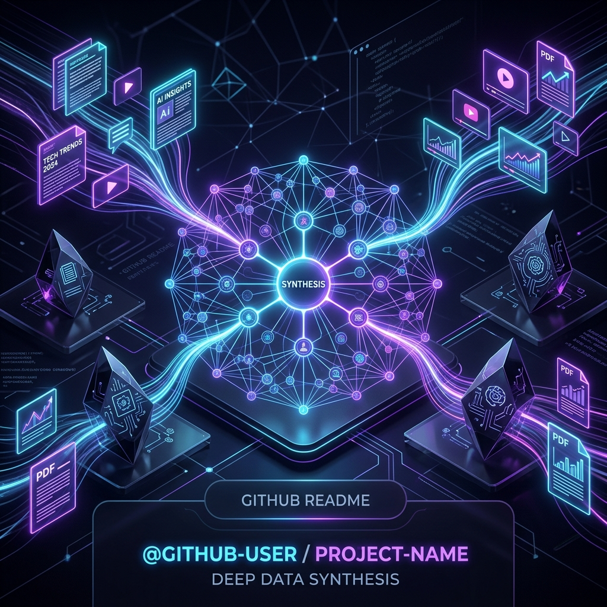
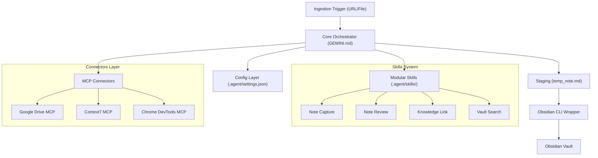

# Obsidian Knowledge Curator: Autonomous Lifecycle Agent with Antigravity 2.0


An enterprise-grade, modular AI agent infrastructure designed to autonomously ingest, synthesize, and curate multi-format knowledge streams directly into an Obsidian Personal Knowledge Management (PKM) graph. 

Refactored from a monolithic Claude Project architecture into the **Antigravity 2.0 SDK**, this repository decouples core orchestration directives from capability modules, enabling deterministic, multi-source ingestion while maintaining the strict structural integrity of a large-scale Obsidian knowledge base.

---

## 📌 Executive Summary

Modern AI-assisted knowledge curation often suffers from **Context Decay** and **Intent Drift**—where agents make implicit, undocumented assumptions as the repository grows. This project resolves these issues by implementing a modular, specification-driven agent architecture that acts as an autonomous knowledge architect.

The agent monitors incoming technical resources (YouTube playlists, PDFs, technical docs, and web pages), executes clean metadata validations using web-grounded lookups, generates structured summaries aligned with strict folder conventions, and merges new data into the vault using a structured staging and indexing pipeline.

---

## 🚀 Key Features

*   **Multi-Source Ingestion Engine**: Seamlessly extracts and processes raw text from local or cloud PDFs (Google Drive MCP), live web documentation (Context7 MCP), and YouTube transcripts (via dynamic python-based `youtube-transcript-api` and `yt-dlp`).
*   **Staging/Drafting Execution Pattern**: Employs a staging workflow where complex notes are drafted in-workspace as local markdown files before being cleanly deployed to absolute Vault paths, preventing CLI argument limits and escape issues.
*   **Rigorous Metadata Grounding ("Rule Zero")**: Automates web-search validations of incoming content IDs to verify authors, exact channels, and release dates, preventing hallucinations or false indexing.
*   **Context Preservation ("Slicing")**: Segments long transcripts and complex data structures into discrete logical parts ("slices"), staying well under the 40% LLM context degradation limit.
*   **Automatic Vault Indexing**: Dynamically reads and updates vault-wide `Master Plan — [Topic].md` indexes to insert newly created notes with backlinks and checklist states.
*   **Zero-YAML Compliance**: Generates highly readable Markdown documents following strict vault-specific conventions without introducing YAML frontmatter clutter.

---

## 📐 Architecture Overview

The system transitions from traditional prompt-heavy wrappers into a decoupled, layered agent architecture that leverages declarative tool-calling and Model Context Protocol (MCP) servers.



### 1. The Core Orchestrator (`GEMINI.md`)
Declares system roles, structural standards, and the non-negotiable step-by-step verification pipeline. Decoupled from execution logic, it acts purely as the brain of the agent.

### 2. Config & Preference Layer (`.agent/settings.json`)
Maintains metadata regarding active MCP servers, target Obsidian Vault paths, and model engine rules, ensuring the infrastructure remains environment-agnostic.

### 3. Modular Skills (`.agent/skills/`)
Each capability (link generation, synthesizers, capture tools) is treated as a micro-tool. Decoupling capabilities ensures that individual pipeline steps can be refactored, audited, and tested independently.

---

## 🛠️ Tech Stack

*   **Orchestration Engine**: Antigravity 2.0 SDK (Google DeepMind)
*   **Primary LLM**: Gemini 3.1 Pro (Optimized for 2M token context, high-fidelity tool-calling, and strict logical validation)
*   **Integration Layer**: Model Context Protocol (MCP)
*   **Runtime Utilities**: Python 3.11+ / UV Package Manager (for sandboxed Python execution)
*   **Integration Interfaces**: Obsidian CLI (local Electron/App binding)
*   **Web Scrapers & scrapers**: `youtube-transcript-api`, `yt-dlp`

---

## 📂 Repository Structure

```
obsidianKnowledgeCurator/
├── .agent/
│   ├── settings.json       # MCP configs, vault paths & model preferences
│   └── skills/             # Modular, reusable agent capability folders
│       ├── daily-note/     # Automated daily journaling capture
│       ├── knowledge-link/ # WikiLink graph analysis & orphan note linking
│       ├── knowledge-synthesis/ # Deep context synthesizers across notes
│       ├── note-capture/   # Ingestion and metadata cleanup routines
│       ├── note-review/    # Vault health check and formatting auditor
│       └── vault-search/   # Context-aware semantic vault queries
├── GEMINI.md               # Core System Orchestrator rules & ROL
├── MIGRATION_ARCHITECTURE.md # Architectural blueprint of Claude -> Antigravity migration
├── README.md               # Project documentation and entry point
└── analysis_results.md     # Production retrospective and improvements tracker
```

---

## 🔄 End-to-End Workflow

```
[Ingestion] -> [Rule Zero Lookup] -> [Transcript Extraction] -> [Summary Synthesis] -> [Local Drafting] -> [Staging Validation] -> [Vault Sync]
```

1.  **Ingestion & Metadatos Inferences**: An input source is identified. The agent runs **Rule Zero** web queries using Google Search to lock down exact video/document title and creators.
2.  **Extraction**: The system invokes sandboxed `youtube-transcript-api` calls to parse transcripts into cleaned paragraph blocks.
3.  **Drafting**: The agent writes the output into a temporary file (`temp_note.md`) in the workspace, bypassing raw console argument limitations.
4.  **Formatting Audits**: The agent validates layout consistency, ensuring `## 📌 Key Takeaways`, Flashcards, Glosario, and Related files exist, and that `#no-read-yet` tags are present.
5.  **Deployment**: The staging draft is copied directly to the active Vault path using path-safe operations, and the local draft is scrubbed.
6.  **Master Plan Splicing**: The related `Master Plan` indexes are dynamically updated to incorporate the new knowledge entry.

---

## 🏆 Engineering Goals

*   **Strict Modularity**: Decoupling configuration from instructions means this agent can be adapted to other target PKM structures simply by swapping settings and skills.
*   **Context-Preservation**: By strictly enforcing the "Slicing" and "Syncing" workflows, the agent maintains an extremely small active token fingerprint, leading to rapid execution and no context degradation.
*   **Robust Fault Tolerance**: Fallback chains (such as switching from standard scrapers to package-specific API requests) ensure the agent is highly resilient to external API failures.
*   **Absolute Integrity**: Non-negotiable protection of existing notes and historical data folders (e.g., `dswok/`) through sandbox constraints.

---

## 🗺️ Roadmap & Future Improvements

- [ ] **Vector Graph Embedding MCP**: Integration of custom semantic search MCPs to automatically suggest highly relevant links under "Related Notes" without human intervention.
- [ ] **Multi-Agent Synthesizer**: Spawning a specialized sub-agent dedicated exclusively to resolving visual formatting audits via Chrome browser snapshots.
