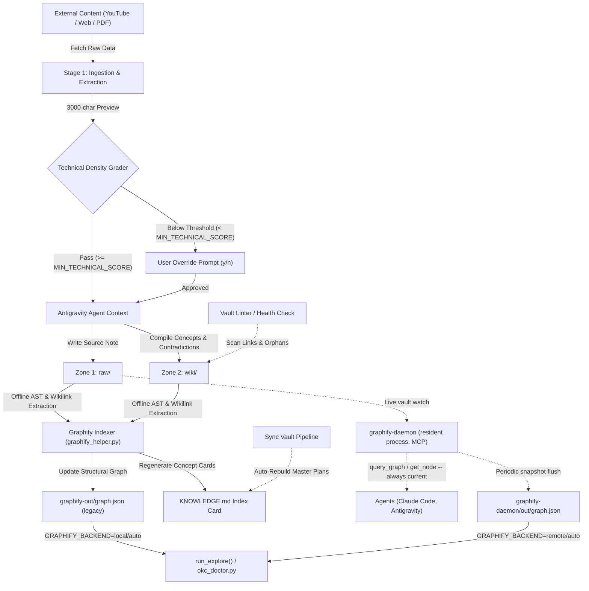

# Obsidian Knowledge Curator — Antigravity 2.4.0

<p align="center">
  
</p>


An autonomous, agentic knowledge compiler designed to maintain and synthesize a "Second Brain" within an Obsidian Vault. Built natively with the **Google Antigravity SDK** and **Gemini 3.1 Pro**, this system automates the ingestion of technical articles, YouTube videos, and research papers, filtering content via an automated **Technical Density Grader**, indexing structural relationships via **Graphify.net**, and maintaining a decoupled skill-data architecture.

---

## 👋 For Non-Technical Readers

**What this is.** A personal automation system that turns a large, ever-growing pile of technical reading (articles, videos, podcasts, books) into a structured, searchable knowledge base — automatically. Instead of bookmarking content and never revisiting it, the system reads it, judges whether it's actually worth keeping, extracts the key ideas, cross-links them to everything already known, and flags contradictions as understanding evolves.

**Who it's for.** Built and maintained by one engineer for personal use — a working example of applying real software-engineering discipline (automated tests, architecture decision records, staged rollouts, health monitoring) to a personal productivity problem, not a commercial product or team tool.

**Why it matters.** It demonstrates hands-on experience with skills relevant well beyond this project: designing multi-stage automation pipelines, orchestrating multiple AI models efficiently (grading content before spending compute on it, avoiding unnecessary API costs), building systems that degrade gracefully when a data source fails or changes instead of breaking outright, and documenting the reasoning behind architectural decisions so the system stays legible over time (see [`docs/adr/`](docs/adr/)).

**Maturity.** Actively developed and in daily personal use, managing a growing multi-thousand-note vault. Not intended for external users or production deployment — no support contract, no SLA, no multi-tenant design.

**What's under the hood, in plain terms:**
- **Reads and judges content before saving it** — automatically scores incoming articles and videos for how substantive they are, so low-value content doesn't clutter the knowledge base.
- **Builds a live map of how ideas connect** — every note is linked to related concepts automatically, without paying an AI model to work out the connections every time.
- **Catches contradictions** — flags when a newer note disagrees with something recorded earlier, instead of silently letting outdated conclusions persist.
- **Runs a full health check on demand** — one command audits the entire knowledge base (broken links, duplicate content, orphaned files, structural integrity) and can auto-repair common issues.
- **Keeps working when a data source misbehaves** — web scraping has three fallback tiers, so a paywall or a blocked scraper doesn't just fail silently.

The rest of this document is the technical reference — architecture, setup, and workflow detail for engineers evaluating or extending the system. Start with [Key Architectural Innovations](#-key-architectural-innovations) for the plain-terms list above translated into implementation detail.

---

## 📖 Table of Contents
- [For Non-Technical Readers](#-for-non-technical-readers)
- [Project Overview](#-project-overview)
- [Problem Statement](#-problem-statement)
- [Key Architectural Innovations](#-key-architectural-innovations)
- [System Architecture](#-system-architecture)
- [Getting Started & Agent Installation](#-getting-started--agent-installation)
- [The "Zone" Knowledge Architecture](#-the-zone-knowledge-architecture)
- [End-to-End Workflow](#-end-to-end-workflow)
- [AI & Agent Components](#-ai--agent-components)
- [Security & Sandboxing](#-security--sandboxing)
- [Technology Stack](#-technology-stack)
- [Future Improvements & Lessons Learned](#-future-improvements--lessons-learned)

---

## 🎯 Project Overview

This project serves as an advanced production implementation of the **LLM Wiki Paradigm** (inspired by Andrej Karpathy's concept of LLMs as knowledge compilers rather than simple chatbots). 

Instead of treating the AI as a search engine over raw documents (like traditional RAG), the **Obsidian Knowledge Curator** acts as an active maintainer of a local filesystem database. It reads raw inputs, grades source density, extracts core concepts, updates existing Wiki pages, flags contradictions natively, and builds a chronological trace of evolving ideas across thousands of notes.

---

## 🧠 Problem Statement

**The Engineering Challenge:** 
Knowledge workers and AI Engineers consume vast amounts of technical content (papers, documentation, videos). Traditional PKM (Personal Knowledge Management) systems rely on manual synthesis, while modern LLM chatbots (chat-with-PDF) fail to compound knowledge over time because they lack persistent state and cross-document reasoning. Furthermore, naive LLM graph compilation introduces massive API token costs and high query latencies.

**The Solution:** 
A headless, zero-token-overhead automation pipeline that ingests content, parses transcripts, evaluates technical density, and uses an **Offline AST Graphify Indexer** to map vault relationships without external LLM API costs.

---

## 💡 Key Architectural Innovations

### 1. Technical Density Ingestion Grader (`MIN_TECHNICAL_SCORE`)
Before any source (YouTube video, Web article, Tweet) is written to the vault, a 3,000-character preview is evaluated across three dimensions:
- **Information Density** (lack of fluff, factual saturation).
- **Provenance & References** (citations, data points, verified authors).
- **Technical Level** (code architecture relevance, concrete implementations).

If the composite score falls below `MIN_TECHNICAL_SCORE` (configured in `.env`, default: `60`), ingestion halts, presenting a detailed scorecard and summary to the user for explicit override confirmation.

### 2. Zero-Cost Offline Graphify Indexing & Hybrid Mapper (`graphify_mapper.py`)
To enable graph-aware context retrieval across 13,000+ notes without incurring API costs or latency penalties:
- **AST & Wikilink Parser**: Uses local Python regex and Markdown AST parsing to extract document headings, parent-child nesting, and `[[wikilinks]]`.
- **Hybrid Local Context Engine (`GraphifyMapper`)**: Pre-predicts target `raw/` categories and matches existing `wiki/` concepts (<50ms latency, $0.00 token cost) directly from `graphify-out/graph.json`. It falls back to lightweight LLM queries only if local graph matching confidence drops below 70%.
- **Injected Ingestion Context**: Automatically injects `"graphify_context"` objects into `temp/fetched_data.json` across all ingestion scripts (`fetch_article_data.py`, `fetch_youtube_data.py`, `fetch_twitter_data.py`, `fetch_book_data.py`).
- **dswok Integration**: Indexes protected external knowledge directories (`dataScienceKnowledgeBase/dswok`) as a read-only information graph without modifying any files within them.

### 3. Podcast & Audio Ingestion Pipeline (`/okc-urlPodcast` & `fetch_podcast_data.py`)
- **Multi-Platform Support**: Ingests podcasts from Siemens.FM, Spotify, Apple Podcasts, RSS feeds, YouTube audio, and direct `.mp3`/`.m4a` files using `yt-dlp` and `curl`.
- **Offline Whisper Transcription**: Uses local **Buzz CLI** (`/Applications/Buzz.app/Contents/MacOS/Buzz`) to transcribe audio tracks offline without external API costs.

### 4. 3-Tier Scraping Fallbacks & Audio Auto-Detection (`fetch_article_data.py`)
- **Audio Redirection**: Automatically detects podcast/audio URLs or HTML `og:audio` tags and delegates execution to `fetch_podcast_data.py`.
- **Tier 1 (Fast Extraction)**: Uses `mcp-server-fetch` or `trafilatura`.
- **Tier 2 (Browser User-Agent & SSL Bypass)**: Automatically escalates to DOM parsing with custom User-Agents and SSL verification bypass when encountering paywalls, captchas, LinkedIn, or Medium restrictions.
- **Tier 3 (Web Search Fallback)**: Uses `search_web` to compile verified summaries if a page is 100% inaccessible.

### 5. Mandatory Local Image Preservation Engine (`fetch_article_data.py` & `fetch_book_data.py`)
- **Automated Asset Extraction**: Automatically parses image URLs from web articles (HTML `` tags, markdown ``, Medium `miro.medium.com`, etc.) and books during processing.
- **Local Download & Offline Self-Containment**: Downloads remote images directly into `<VAULT_ROOT>/assets/images/<slug>-img-<idx>.<ext>` via HTTP/SSL-bypass, eliminating fragile external link dependencies.
- **Native Obsidian Wikilink Embeddings**: Replaces remote image links with native wikilink syntax `![[assets/images/<file>.png]]`, ensuring 100% offline readability and graph visual consistency.

### 6. Decoupled Skill Factory (`SKILL.md` vs `KNOWLEDGE.md`)
To prevent system prompt inflation and context degradation:
- **Behavior Prompt (`SKILL.md`)**: Contains pure agent execution rules, wikilink mandates, and non-hallucination constraints.
- **Compiled Static Database (`KNOWLEDGE.md`)**: An automatically regenerated index containing ~600+ concept cards with absolute file links across the vault.

### 7. OKC Doctor & Full Diagnostics Suite (`/okc-doctor` & `scripts/okc_doctor.py`)
A unified 7-stage health check, integrity audit, and synchronization suite:
- **SQLite Differential Index**: Rapid scan and synchronization across 3,000+ files.
- **Multi-Category Master Plans**: Dynamic regeneration of all navigation maps.
- **Wikilink & Contradiction Linter**: Deep scan for broken links, orphan notes, and explicit `[!contradiction]` tags.
- **Invisible Unicode (ZWSP) Hygiene**: Detects and sanitizes zero-width space characters with `--fix`.
- **Visual Asset Inspector**: Audits `assets/images/` total vs unreferenced visual assets.
- **Protected Zones Immutability Audit**: Ensures zero unauthorized modifications across protected engineering zones.
- **Graphify & `KNOWLEDGE.md` Rebuild**: Updates `graph.json`, `graph_cache.json`, and the concept index in one pass.

### 8. Note Normalizer & Header Sanitizer (`scripts/normalize_notes.py`, `/okc-normalize`)
An automated audit, deduplication, and header standardization engine (ADR 0006):
- **Content Hash Deduplication**: Computes SHA-256 digests of markdown content to identify identical notes across folders, safely archiving duplicates into a local `_archive/` directory.
- **Empty & Low-Value Stub Elimination**: Detects and isolates notes lacking substantial content or structure, preserving a high signal-to-noise ratio in the knowledge graph.
- **Canonical Blockquote Injection**: Detects missing metadata headers and non-destructively prepends canonical Obsidian blockquote schema (`Author`, `Source`, `Type`, `Processed`, and `Tags: #no-read-yet`).
- **Atomic Database & Master Plan Sync**: Includes `--sync` to automatically update the SQLite differential index and Category Master Plans in a single operation.

### 9. Managed Study Decks & Anki MCP Synchronization Engine (`scripts/study_deck.py`, `/okc-study`)
An automated spaced repetition, active recall, and pedagogical flashcard synthesis engine (ADR 0007):
- **SuperMemo 20-Rules Compliance**: Generates atomic `Basic` (Q/A) and `Cloze` (`{{c1::...}}`) flashcards grounded in verifiable `SourceSpan` evidence slices.
- **AST Parsing & Math/Table Fidelity**: Uses `markdown-it-py` to parse source notes while maintaining LaTeX formulas (`$...$`, `$$...$$`), fenced code blocks, and markdown tables.
- **Direct Anki MCP & AnkiConnect Push**: Automatically creates decks, uploads media assets, and synchronizes cards via the Anki MCP server or local AnkiConnect HTTP API (`http://127.0.0.1:8765`).
- **Three-Way Merge with Human Preservation**: Retains user modifications to card fronts and backs in Markdown while updating source notes; records deleted cards in `study_suppressions` to prevent resurrection.
- **Deep Visual Architecture**: Clones diagram and figure assets by SHA-256 hash into `<VAULT_ROOT>/assets/images/study/`, generating dedicated architectural visual recall cards.
- **Two-Phase Commit (2PC) Journal & Crash Recovery**: Logs write transactions (`PREPARED` -> `COMMITTED`), performs atomic staging swaps, and provides `study_deck.py recover` to prevent partial state corruption.

### 10. High-Density Active Recall (HDAR) Book Flashcard Engine (`scripts/book_flashcards_engine.py`, `/okc-bookFlashcards`)
An end-to-end active recall flashcard generation and synchronization engine for technical books (ADR 0008):
- **HDAR 7-Rule Pedagogical Rubric**: Enforces zero-hallucination factual grounding, atomic information retrieval, causal mechanisms over superficial facts, and balanced bilingual technical terminology.
- **Whole-Book Decomposition & Extraction**: Parses EPUB and PDF non-fiction books into structured semantic chapters, section hierarchies, and embedded visual media.
- **Resilient Chapter Checkpointing**: Maintains incremental state in `checkpoint.json` to allow resume-on-failure across 10+ chapters without reprocessing or data loss.
- **Automated Deduplication & Global Audit**: Evaluates candidate cards across chapters, eliminates semantic duplicates, and outputs comprehensive audit reports (`audit_report.md`).
- **Multi-Platform Convergence**: Simultaneously generates 1-click Anki import files (`.tsv`), structured JSON databases, native Obsidian study notes (`<VAULT_ROOT>/.../study/<Deck Name>.md`), and executes direct AnkiConnect synchronization with embedded diagrams.


---

## 🏗 System Architecture



---

## 🚀 Getting Started & Agent Installation

### 1. System Requirements

This project runs locally and relies on Python 3.12+ and external command-line utilities.

*   **Python Package Manager:** [uv](https://github.com/astral-sh/uv) (required for high-speed, isolated environment management).
*   **Browser Scraping:** [Google Chrome](https://www.google.com/chrome/) or Chrome Canary (installed locally, required for dynamic CDP JS rendering).
*   **Media Processing:** [ffmpeg](https://ffmpeg.org/) (required by `yt-dlp` to extract audio streams).
*   **Local Transcription Fallback:** [Buzz CLI](https://github.com/chidiwilliams/buzz) (required for offline Whisper transcription fallback).

---

### 2. Installation Steps

#### Step 1: Install OS Prerequisites

**macOS (via Homebrew):**
```bash
# Install uv and ffmpeg
brew install uv ffmpeg

# Install Buzz (GUI + CLI)
brew install --cask buzz

# Install Graphify CLI
uv tool install "graphifyy[gemini]"
```

**Linux (Ubuntu/Debian):**
```bash
# Install uv
curl -LsSf https://astral.sh/uv/install.sh | sh

# Install ffmpeg
sudo apt update && sudo apt install -y ffmpeg
```

#### Step 2: Clone & Setup Workspace

```bash
# Clone the repository
git clone https://github.com/c-ibarra/obsidianKnowledgeCurator.git
cd obsidianKnowledgeCurator

# Install dependencies and setup virtual environment
uv sync
```

#### Step 3: Run Interactive Setup Wizard

Run the automated setup wizard to configure your local `.env` securely from `.env.template`, auto-detect your Obsidian Vault (`~/Documents/Obsidian`), and validate system dependencies:
```bash
# Interactive setup in terminal
uv run python scripts/setup_project.py

# Or within Antigravity chat:
/okc-setup
```

Alternatively, manually copy the template and edit your `.env`:
```bash
cp .env.template .env
```

#### Step 4: Initialize the Knowledge Graph & Skills

Build the initial structural graph across your vault and compile the `KNOWLEDGE.md` concept cards index:
```bash
# Verify vault health, rebuild Master Plans, and compile Graphify index
uv run python scripts/sync_vault.py --target-kb all
```

#### Step 5: Configure Anki Client & Anki MCP Server

To enable bi-directional spaced repetition flashcard generation and automatic synchronization (`/okc-study`):

1. **Install and Open Anki**:
   - Download and install [Anki](https://apps.ankiweb.net/).
   - Ensure Anki is running in the background during synchronization.

2. **Install the AnkiConnect Add-on**:
   - In Anki, navigate to: `Tools` ➔ `Add-ons` ➔ `Get Add-ons...`
   - Enter the AnkiConnect code: **`2055492159`** and click OK.
   - Restart Anki.

3. **Configure AnkiConnect CORS / Allowed Origins**:
   - Go to `Tools` ➔ `Add-ons`, select **AnkiConnect**, and click **Config**.
   - Ensure `webCorsOriginList` includes local loopbacks and `apiKey` is empty (default) or matches your configuration:
     ```json
     {
         "apiKey": null,
         "apiHost": "127.0.0.1",
         "apiPort": 8765,
         "webCorsOriginList": [
             "http://localhost",
             "http://127.0.0.1",
             "*"
         ]
     }
     ```
   - Restart Anki. Test connection by running `curl http://127.0.0.1:8765` (should return `"AnkiConnect"`).

4. **Configuring / Updating the Anki MCP Server in Antigravity / Claude Code**:
   - The Anki MCP server is registered in your agent client configuration (`mcp_config.json` or Antigravity's settings).
   - If using `npx` or standard node MCP runner:
     ```json
     {
       "mcpServers": {
         "anki": {
           "command": "npx",
           "args": ["-y", "@modelcontextprotocol/server-anki"],
           "env": {
             "ANKI_CONNECT_URL": "http://127.0.0.1:8765"
           }
         }
       }
     }
     ```
   - If using python-based `anki-connect-mcp`:
     ```json
     {
       "mcpServers": {
         "anki": {
           "command": "uvx",
           "args": ["anki-connect-mcp"]
         }
       }
     }
     ```
   - To update the Anki MCP server, force cache refresh via `npx -y @modelcontextprotocol/server-anki@latest` or `uvx --upgrade anki-connect-mcp`.
   - *Note*: Even if the MCP server is idle or offline, `scripts/study_deck.py` automatically falls back to native direct HTTP calls against `http://127.0.0.1:8765` to guarantee reliable synchronization without interruptions.


---

## 🗂 The "Zone" Knowledge Architecture

The vault is strictly divided into four zones to separate immutable sources from synthesized concepts:

| Zone | Purpose | Agent Permissions |
|---|---|---|
| **`raw/`** | Immutable sources (Video transcripts, Web clippings). | **Append-Only**. The agent saves summaries here but never modifies historical sources. |
| **`wiki/`** | Synthesized concepts and entities. | **Read-Write**. Fully maintained by the LLM. The agent creates pages, injects wikilinks, and merges updates. |
| **`dev/`** | Architecture Decision Records (ADRs) and project files. | **Collaborative**. The agent acts as a co-pilot but requires explicit human approval to modify. |
| **`dswok/`** | Protected external personal knowledge base. | **Read-Only / Indexed**. The agent scans and indexes relationships into `graph.json` but **never writes or modifies files**. |

---

## 🔄 End-to-End Workflow

### 1. Multimedia & Podcast Ingestion (`fetch_youtube_data.py` & `fetch_podcast_data.py`)
- **YouTube**: Extracts audio streams (`m4a` format 140) via `yt-dlp` utilizing the `--live-from-start` parameter to bypass dynamic live DASH fragment limits. Transcribes audio using `youtube-transcript-api` with fallback to local **Buzz CLI Whisper**.
- **Podcasts & Audio (`/okc-urlPodcast`)**: Ingests Siemens.FM, Spotify, Apple Podcasts, RSS feeds, or direct `.mp3`/`.m4a` files. Downloads audio tracks via `yt-dlp`/`curl` and transcribes them using local **Buzz CLI Whisper**.
- Evaluates technical density against `MIN_TECHNICAL_SCORE`.
- Pre-calculates `"graphify_context"` via `GraphifyMapper` to select raw target categories and link existing wiki concept notes.
- Writes curated summary to `raw/` and compiles 3-7 concept notes to `wiki/`.

### 2. Resilient Web Article Ingestion (`fetch_article_data.py` & `/okc-urlArticle`)
- **Audio Auto-Detection**: Automatically detects audio URLs or `og:audio` tags and delegates to `fetch_podcast_data.py`.
- **3-Tier Fallback Chain**: Tier 1 (`mcp-server-fetch`), Tier 2 (DOM extraction with custom browser User-Agent and SSL bypass for restricted sites like LinkedIn/Medium), Tier 3 (search-backed compilation).
- Pre-calculates `"graphify_context"` via `GraphifyMapper`.

### 3. Non-Fiction Book Ingestion & Synthesis (`fetch_book_data.py` & `okc-bookSummary`)
- **High-Density Actionable Synthesis (HDAS Standard)**: Produces rich, 7-section modular chapter notes combining dense narrative prose with active learning tools (Central Thesis & 1-Sentence Insight, Inquiry Questions, Enriched Summary Development with Mental Models, Visual Metaphor / Key Quote / Common Pitfall Callouts, Smart Cross-Domain Commentary, Practical Application Guide with 15-minute challenges, and Executive 1-Sentence Takeaway).
- **Automated Structure Parsing**: Ingests PDF, EPUB, DOCX, and TXT files, segmenting chapters and sanitizing text.
- **Default Obsidian Vault Output**: Writes main book summaries and individual chapter notes (`Chapter XX — <Title>.md`) directly to `VAULT_ROOT/dataScienceKnowledgeBase/<Category>/raw/books/`.
- **Enforced Chapter Depth (1,600–2,650 words total)**: Requires dense explanatory narrative for Section 3 (Enriched Summary Development) to ensure thorough technical and conceptual depth.
- **Visual Content & Mermaid.js Diagrams**: Reconstructs mindmaps, architecture flows, sequence diagrams, and embeds extracted figures (`assets/images/`).
- **Executive Master Note Hub**: Compiles comprehensive master notes with full-book architecture mindmaps, mental models index, `#flashcard` spaced repetition cards, and specialized glossaries.
- **Automatic Temporary File Cleanup**: Cleans up all working files in `temp/` via `--clean` upon completion.

### 4. Office Document & Format Ingestion (`fetch_doc_data.py` & `/okc-doc`)
- **Multi-Format Extraction**: Ingests `.docx`, `.pptx`, `.xlsx`, `.epub`, `.pdf`, `.odt`, and `.csv` using the unified AnyDoc engine (`src/agent_tools/anydoc_engine.py`).
- **Embedded Asset Extraction**: Extracts embedded figures and charts directly to `<VAULT_ROOT>/assets/images/` and links them with native Obsidian wikilinks.

### 5. Structural Graph Sync (`graphify_helper.py`, `sync_vault.py` & `graphify-daemon`)
- Incrementally updates `graphify-out/graph.json` after every note edit (legacy pipeline).
- Automatically regenerates `.agents/skills/obsidian-knowledge-curator/KNOWLEDGE.md` with updated concept links.
- Rebuilds Category Master Plans and audits wikilink health via `vault_linter.py`.
- **`graphify-daemon`** (a separately-maintained resident process, `~/projects/graphify-daemon`) serves the same concept graph over MCP from an always-current in-RAM snapshot — no rebuild step, republishes on every vault batch. Agents (Claude Code, Antigravity) query it directly via its MCP tools (`query_graph`, `get_node`, `shortest_path`, etc.) whenever it's running.
- `scripts/knowledge_commands.py`'s `run_explore()` and `scripts/okc_doctor.py`'s dashboard node/edge counts read from the daemon by default too, controlled by `GRAPHIFY_BACKEND` in `.env` (`auto`/`local`/`remote` — see ADR 0005 and `.agents/rules/graphify.md` for the full architecture, including the scope/freshness trade-offs between the legacy pipeline and the daemon). `vault_linter.py`/`update_master_plan.py` remain local-only — the daemon doesn't index vault metadata (titles, links, contradictions), only the concept graph.

### 6. Full Diagnostics & Auto-Repair (`scripts/okc_doctor.py`, `/okc-doctor`)
- Comprehensive 7-stage health check across the entire vault.
- Runs SQLite index differential sync, multi-category Master Plan updates, dead wikilink & contradiction scans, invisible unicode (ZWSP) sanitation (`--fix`), visual assets inspection, and Graphify rebuild.

### 7. Note Normalization & Deduplication (`scripts/normalize_notes.py`, `/okc-normalize`)
- Recursively audits target vault folders for duplicate files, empty stubs, and missing canonical headers.
- Runs in safe dry-run mode by default, or with `--fix` to archive duplicates/stubs into `_archive/` and inject canonical blockquotes.
- Seamlessly integrates with `--sync` to trigger an atomic SQLite index rebuild and Master Plan update.

### 8. Study Decks, Flashcard Synthesis & Anki MCP Pipeline (`scripts/study_deck.py`, `/okc-study`)
A multi-modal spaced repetition and active recall engine:
- **`create`**: Ingests notes, parses AST structures (`markdown-it-py`), extracts atomic `KnowledgeUnits`, applies SuperMemo 20-rules validation, writes `<RootFolder>/study/<Deck Name>.md`, and syncs directly to Anki via MCP.
  ```bash
  uv run python scripts/study_deck.py create --source "<folder_or_note>" --deck "<DeckName>" [--anki-deck "<AnkiName>"]
  ```
- **`add`**: Dynamically binds new notes or source folders to an existing deck without duplicate card creation.
  ```bash
  uv run python scripts/study_deck.py add --source "<new_source>" --deck "<DeckName>"
  ```
- **`update`**: Runs a **Three-Way Merge** across Markdown edits, SQLite persistence, and Anki. Automatically preserves human card modifications, suppresses user-deleted cards from reappearing, and pushes edits to Anki via `updateNoteFields` without resetting SRS review intervals.
  ```bash
  uv run python scripts/study_deck.py update --deck "<DeckName>"
  ```
- **`sync-anki`**: Pushes pending or unsynced flashcards and frozen image media to Anki.
  ```bash
  uv run python scripts/study_deck.py sync-anki --deck "<DeckName>"
  ```
- **`recover`**: Scans the Two-Phase Commit (`PREPARED` -> `COMMITTED`) journal to clean up or complete dangling transactions after system halts or unexpected crashes.
  ```bash
  uv run python scripts/study_deck.py recover [--clean-only]
  ```

### 9. High-Density Active Recall (HDAR) Book Flashcard Ingestion (`scripts/book_flashcards_engine.py`, `/okc-bookFlashcards`)
A specialized engine for processing entire technical books into active recall decks:
- **Full Book Ingestion**: Extracts chapters, sections, and figures directly from EPUB or PDF non-fiction books:
  ```bash
  uv run python scripts/book_flashcards_engine.py --input "<path_to_epub_or_pdf>" --deck "<DeckName>"
  ```
- **Direct Anki Sync & Overwrite Protection**:
  ```bash
  # Ingest and automatically push cards and media to Anki:
  uv run python scripts/book_flashcards_engine.py --input "<path>" --deck "<DeckName>" --sync-anki

  # Replace an existing deck cleanly:
  uv run python scripts/book_flashcards_engine.py --input "<path>" --deck "<DeckName>" --sync-anki --replace-deck
  ```
- **Resumed Execution & Incremental Processing**:
  ```bash
  # Check current checkpoint status:
  uv run python scripts/book_flashcards_engine.py --deck "<DeckName>" --status

  # Re-compile multi-format outputs from existing checkpoint cards:
  uv run python scripts/book_flashcards_engine.py --deck "<DeckName>" --compile
  ```

---


## 🛠 Technology Stack

| Category | Technology | Purpose |
|---|---|---|
| **Core AI Model** | Gemini 3.1 Pro | Primary reasoning, text generation, and synthesis engine. |
| **Agent Framework** | Google Antigravity SDK | Tool calling, subagent orchestration, and skill workflows. |
| **Knowledge Graph** | Graphify.net (`graphifyy`) | Structural AST/wikilink graph indexing ($0.00 token cost). |
| **Backend & Scripting**| Python 3.12+, `uv` | High-speed, deterministic local execution environment. |
| **Media & Scraping** | Chrome CDP, `yt-dlp`, `Buzz CLI` (Whisper), `BeautifulSoup4` | Dynamic CSR web scraping, audio extraction, and local speech-to-text. |
| **Knowledge Base** | Obsidian | Markdown-based local filesystem database. |
| **Spaced Repetition** | Anki, AnkiConnect, Anki MCP | Active recall flashcards, media upload, and SRS scheduling. |
| **AST Parsing** | `markdown-it-py` | Strict markdown tokenization and structure extraction. |

---


## 🚀 Future Improvements & Lessons Learned

**Future Improvements:**
1. **Incremental Graph Indexing Cache**: Instead of crawling the entire vault and AST-parsing all 13,000+ notes on initialization, cache nodes and edges per file. Only re-parse files whose modification times (`mtime`) have changed to ensure sub-second startup times as the vault scales.
2. **Local Hybrid Search (AST Graph + Offline Embeddings)**: Incorporate a local vector database using a lightweight model (e.g., `sentence-transformers` via `uv` in Python) to enable semantic search alongside structural AST link-graphs at zero API token cost.
3. **Platform-Agnostic Whisper Fallback**: Transition the macOS-only desktop `Buzz CLI` Whisper dependency to a standalone python library (e.g. `faster-whisper` or `openai-whisper` via `uv`) to enable headless/remote environment compatibility.
4. **Structured Note Schema Validation**: Use a Python schema validator (e.g., Pydantic) to ensure generated note structures strictly conform to vault conventions before writing, eliminating any potential markdown structure formatting drifts.
5. **Autoshared Session Scraping via CDP**: Allow the headless Chrome browser to load user Chrome profiles or cookies in order to fetch paywalled or subscriber-only technical publications (e.g. paid Medium or Substack newsletters).
6. **Rejected Source Audit Logs**: Log low technical density scorecards to `temp/rejected_sources.json` for batch human audits instead of halting ingestion processes on immediate interactive prompts.

**Lessons Learned:**
1. **AST vs. LLM Indexing**: Using local Python AST parsers (`graphify_helper.py`) to build graph relationships saves **95%+ in query latency** and **100% in graph index cost** compared to LLM-based graph extraction.
2. **Quality Gates Matter**: Implementing the `MIN_TECHNICAL_SCORE` pre-fetch grader prevents low-quality web fluff from polluting the `wiki/` concept graph.
3. **Decoupled Skill Architecture**: Separating agent rules (`SKILL.md`) from static compiled knowledge (`KNOWLEDGE.md`) maintains lightweight system prompts while giving agents instant access to 500+ concept cards.
