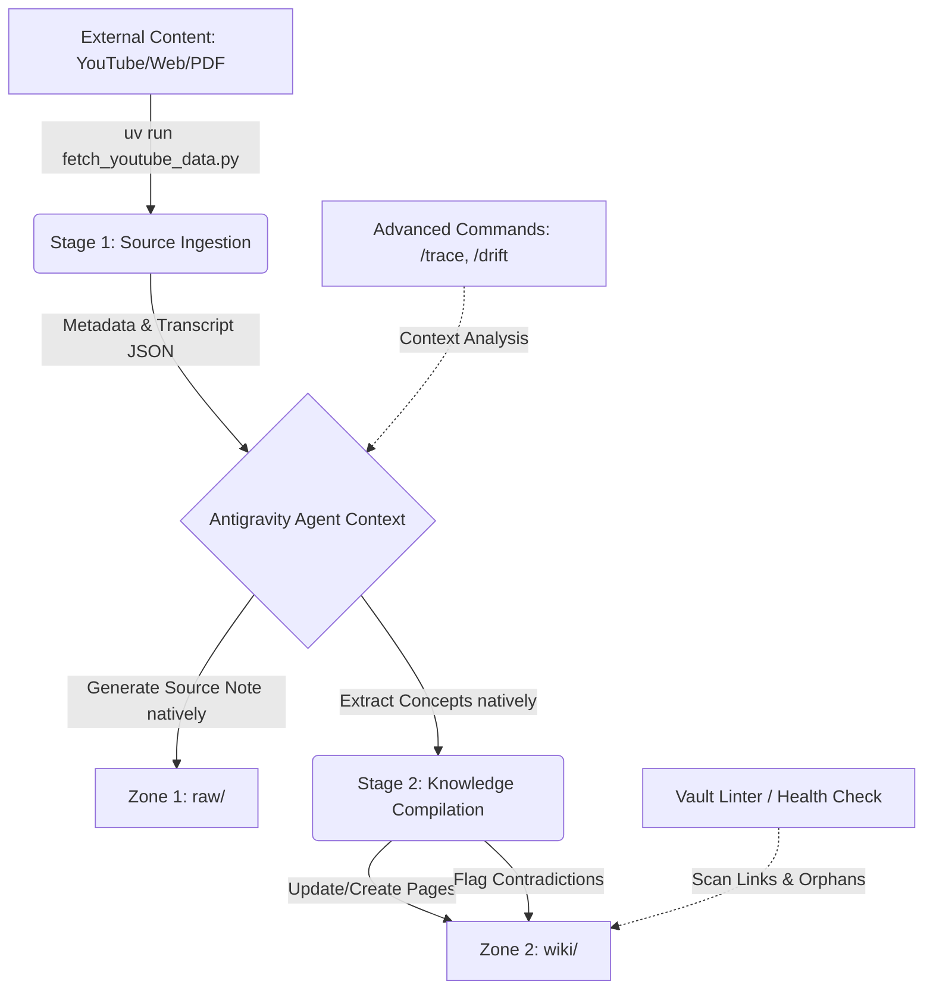

# Obsidian Knowledge Curator — Antigravity 2.0

<p align="center">
  
</p>


An autonomous, agentic knowledge compiler designed to maintain and synthesize a "Second Brain" within an Obsidian Vault. Built natively with the **Google Antigravity SDK** and **Gemini 3.1 Pro**, this system automates the ingestion of technical articles, YouTube videos, and research papers, seamlessly weaving them into a highly structured, living knowledge graph.

---

## 📖 Table of Contents
- [Project Overview](#project-overview)
- [Problem Statement](#problem-statement)
- [Getting Started & Installation](#getting-started--installation)
- [System Architecture](#system-architecture)
- [The "Zone" Knowledge Architecture](#the-zone-knowledge-architecture)
- [End-to-End Workflow](#end-to-end-workflow)
- [AI & Agent Components](#ai--agent-components)
- [Context & Memory Management](#context--memory-management)
- [Security & Sandboxing](#security--sandboxing)
- [Technology Stack](#technology-stack)
- [Future Improvements & Lessons Learned](#future-improvements--lessons-learned)

---

## 🎯 Project Overview

This project serves as an advanced implementation of the **LLM Wiki Paradigm** (inspired by Andrej Karpathy's concept of LLMs as knowledge compilers rather than simple chatbots). 

Instead of treating the AI as a search engine over documents (like traditional RAG), the **Obsidian Knowledge Curator** acts as an active maintainer of a local filesystem database. It reads raw inputs, extracts core concepts, updates existing Wiki pages, flags contradictions, and builds a chronological trace of evolving ideas.

## 🧠 Problem Statement

**The Engineering Challenge:** 
Knowledge workers and AI Engineers consume vast amounts of technical content (papers, documentation, videos). Traditional PKM (Personal Knowledge Management) systems rely on manual synthesis, while modern LLM chatbots (chat-with-PDF) fail to compound knowledge over time because they lack persistent state and cross-document reasoning.

**The Solution:** 
A headless automation pipeline that ingests content, parses transcripts, and utilizes a large-context model (Gemini 3.1 Pro) to actively rewrite, link, and maintain a local Obsidian Vault graph, separating raw sources from synthesized concepts.

---

## 🚀 Getting Started & Installation

### 1. System Requirements

This project runs locally and relies on Python 3.12+ and external command-line utilities.

*   **Python Package Manager:** [uv](https://github.com/astral-sh/uv) (highly recommended for high-speed, isolated environment management).
*   **Browser Scraping:** [Google Chrome](https://www.google.com/chrome/) or Chrome Canary (installed locally on macOS/Linux/Windows, required for dynamic JS-rendered article scraping).
*   **Media Processing:** [ffmpeg](https://ffmpeg.org/) (required by `yt-dlp` to extract audio streams).
*   **Local Transcription Fallback:** [Buzz CLI](https://github.com/chidiwilliams/buzz) (required for offline Whisper transcription fallback).
*   **High-Fidelity PDF Conversion:** [marker-pdf](https://github.com/VikParuchuri/marker) (used to convert PDF papers into structured Markdown. The first run automatically downloads ~2-3 GB of deep learning models).


---

### 2. OS-Specific Requirements Installation

#### 🍎 macOS (OS X)
Install all prerequisites using [Homebrew](https://brew.sh/):
```bash
# Install uv and ffmpeg
brew install uv ffmpeg

# Install Buzz (GUI + CLI)
brew install --cask buzz
```
*Note: The script expects the Buzz CLI executable at `/Applications/Buzz.app/Contents/MacOS/Buzz`.*

#### 🪟 Windows
Install all prerequisites using PowerShell and [winget](https://learn.microsoft.com/en-us/windows/package-manager/winget/):
```powershell
# Install uv and ffmpeg
winget install astral-sh.uv
winget install Gyan.FFmpeg

# Install Buzz
winget install --id Buzz
```
*Note: Make sure `ffmpeg` and `Buzz` (or the folder containing the `Buzz` CLI binary) are added to your system's `PATH` environment variable.*

#### 🐧 Linux
Install prerequisites using your system's package manager:

**Ubuntu / Debian:**
```bash
# Install uv
curl -LsSf https://astral.sh/uv/install.sh | sh

# Install ffmpeg
sudo apt update && sudo apt install -y ffmpeg
```

**Fedora / RHEL:**
```bash
# Install uv
curl -LsSf https://astral.sh/uv/install.sh | sh

# Install ffmpeg
sudo dnf install -y ffmpeg
```

**Buzz Installation on Linux:**
Download the Linux release AppImage or source compilation package from the [Buzz GitHub Releases](https://github.com/chidiwilliams/buzz/releases) page and place the executable under your `PATH`.

---

### 3. Project Setup

1. **Clone the repository:**
   ```bash
   git clone https://github.com/c-ibarra/obsidianKnowledgeCurator.git
   cd obsidianKnowledgeCurator
   ```

2. **Sync Python dependencies:**
   Using `uv`, run the following command to automatically install Python and create the virtual environment with all required libraries:
   ```bash
   uv sync
   ```

3. **Configure environment variables:**
   Create a `.env` file in the project root:
   ```bash
   cp .env.example .env
   ```
   Edit the `.env` file to set your paths and keys:
   ```env
   OBSIDIAN_VAULT_PATH="/Users/carlosibarra/Library/CloudStorage/OneDrive-Personal/Obsidian"
   GEMINI_API_KEY="your-gemini-api-key-here"
   ```

4. **Verify installation:**
   Run the sync script to compile plans and check vault health:
   ```bash
   uv run python scripts/sync_vault.py
   ```

---

## 🏗 System Architecture

The project eschews heavy cloud abstractions in favor of a fast, local, agentic tooling approach.



### Why Antigravity SDK & Gemini? (Architectural Trade-offs)
* **Alternative Considered:** LangChain or LlamaIndex with a vector database (RAG).
* **Chosen Solution:** Antigravity SDK with Gemini 3.1 Pro using raw Python APIs.
* **Rationale:** I optimized for cost-efficiency and leveraging cutting-edge context windows. Gemini's massive 2M+ token context window allowed me to bypass the complexity, latency, and semantic loss of RAG chunking. By feeding entire vault subsections directly into the prompt, the agent performs superior qualitative synthesis. Furthermore, avoiding heavy abstractions like LangChain reduced execution overhead and gave me precise, deterministic control over the agent's file system I/O.

---

## 🗂 The "Zone" Knowledge Architecture

Before settling on this design, I considered a traditional flat-folder PKM structure. However, mixing raw notes and AI synthesis led to "context rot" and made programmatic updates dangerous. 

The vault is now strictly divided into three zones:

| Zone | Purpose | Agent Permissions |
|---|---|---|
| **`raw/`** | Immutable sources (Video transcripts, Web clippings). | **Append-Only**. The agent saves summaries here but never modifies historical sources. |
| **`wiki/`** | Synthesized concepts and entities. | **Read-Write**. Fully maintained by the LLM. The agent creates pages, injects wikilinks, and merges updates. |
| **`dev/`** | Architecture Decision Records (ADRs) and project files. | **Collaborative**. The agent acts as a co-pilot but requires explicit human approval to modify. |
| **`dswok/`** | Protected personal core. | **Strictly Blocked**. The agent cannot read or write to this directory. |

### 🧠 Adaptive Ingestion Policy (Wiki Density Control)
To prevent the `wiki/` zone from accumulating redundant, stub, or low-value concept pages, the curator implements a strict density control policy:
1. **Immediate Raw Ingestion**: The source note is immediately created/updated in the `raw/` zone following name conventions.
2. **Concept Check**: Before generating any new concept note in the `wiki/` zone, the agent searches for existing similar concepts using the local fast search:
   ```bash
   uv run python scripts/knowledge_commands.py --find "<concept_name>"
   ```
3. **Incremental Update**: If the wiki page already exists, update it. If not, evaluate if it has high architectural significance. If not, link to existing related concepts (e.g., link a RAG sub-technique to `[[QueryTransformation]]` rather than building a stub).
4. **Consolidated Sync**: Rebuild Navigation Map tables and verify the vault's graph integrity by running the unified sync command:
   ```bash
   uv run python scripts/sync_vault.py
   ```

---

## 🔄 End-to-End Workflow

### 1. Multi-Stage Multimedia Ingestion Pipeline (`fetch_youtube_data.py`)
1. **Three-Tier Extraction:** Pulls video transcripts using a resilient three-tier fallback pipeline:
   - *Tier 1:* Online transcripts via `youtube-transcript-api`.
   - *Tier 2:* Auto-generated VTT subtitle downloads via `yt-dlp`.
   - *Tier 3:* Offline fallback downloading the audio as MP3 via `yt-dlp` and transcribing it headlessly via the local **Buzz (Whisper) CLI**.
2. **Raw Generation (Native):** The Antigravity agent natively reads the JSON metadata and transcript text, producing a highly structured markdown summary with an immutable source header blockquote, including the exact processing date (`Processed: DD-MM-YYYY`), key takeaways, flashcards, and glossaries.
3. **Concept Compilation (Native):** Within the same agentic pass, it identifies 3-7 core technical concepts and either creates new `.md` files in the `wiki/` zone or appends the new insights to existing pages.

### 2. Layout-Aware Web Ingestion Pipeline (`fetch_article_data.py`)
1. **Hybrid Rendering Extraction**: Resolves static vs dynamic client-side rendered (CSR) web content (e.g. Substack, Medium, Gemini share links):
   - *Static Fetch*: Direct request-based download via `requests` for fast, low-overhead parsing.
   - *Dynamic CDP Fetch*: Headless local browser orchestration using macOS Chrome Canary/Chrome over Chrome DevTools Protocol (CDP) WebSocket handshakes (`--remote-debugging-port=9222`), allowing full client-side JavaScript execution before dumping the DOM.
2. **Deterministic Layout Parsing**: Employs `BeautifulSoup` to clean HTML trees (decomposing scripts, styles, buttons, headers, and navigation UI) and formats headings, paragraphs, code blocks, lists, and tables into clean GitHub-Flavored Markdown.
3. **Metadata & Content Alignment**: Outputs clean structured JSON metadata and markdown files, ensuring identical pipeline interfaces across both multimedia (YouTube) and text (Web articles) ingestions.

### 3. Advanced Vault Reasoning (`knowledge_commands.py`)
Because the knowledge is structured, the agent can perform deep-vault operations:
- `/okc-trace`: Reconstructs the chronological evolution of an idea across the vault.
- `/okc-emerge`: Scans recent notes to find implicit conclusions or recurring patterns the user hasn't explicitly documented.
- `/okc-drift`: Compares stated intentions in older notes with actual recorded behavior in recent notes.
- `/okc-find <query>`: Performs a fast, case-insensitive note-name substring search, outputting matches as wikilinks and relative file paths.

### 4. Continuous Integration & Sync (`sync_vault.py`, `vault_linter.py`)
To preserve index alignment and check graph health in one step:
- **`sync_vault.py`**: A unified sync runner that updates category/series Master Plans (via `update_master_plan.py`) and executes the vault health check (via `vault_linter.py`) sequentially. Accepts `--target-kb` parameter forwarding.
- **`vault_linter.py`**: A custom Python linter that runs against the vault to ensure graph integrity:
  - Validates all `[[wikilinks]]` against existing files.
  - Detects isolated "orphan" notes.
  - Scans for the `> [!contradiction]` callout, which the agent injects when new sources conflict with existing wiki knowledge.

### 5. Generic Notion Migration & Curation Pipeline (`curate_notion_import.py`)
A parameterizable batch-migration and curation system that ingests imported Notion folder contents:
- Dynamically maps sources using `--notion-dir`, `--target-kb`, and `--course-name` arguments.
- Formats notes to strict zero-YAML Spanish conventions using the active agent context.
- Compiles incremental PascalCase Wiki concept pages with dynamic bidirectional backlinks.
- Automatically builds/updates dynamic Category Master Plan index tables.

---

## 🔒 Security & Sandboxing

Allowing an autonomous agent to perform filesystem I/O requires deliberate constraints. While the system operates entirely locally for maximum privacy, the following security model is enforced:

1. **Path Containment:** The agent's `write_to_file` and `obsidian-cli` execution contexts are strictly jailed to the `obsidianKnowledgeCurator` workspace and the designated Vault path. 
2. **Directory Blacklists:** Critical directories (like `dswok/` and `~/.gemini`) are hardcoded as protected, preventing the agent from modifying system configurations or core personal data.
3. **Execution Safety:** The automation avoids fragile bash scripting (`cat`, `sed`) in favor of deterministic Python file handlers and AST-level modifications, significantly reducing the surface area for Prompt Injections hidden inside scraped web articles.

---

## 🧠 Context & Memory Management

**The Challenge:** Feeding hundreds of notes into an LLM can easily exceed token limits or dilute the model's attention mechanism.

**The Solution:** 
Instead of naive context dumping, the system implements **Targeted Context Gathering**. When executing complex reasoning commands (like `/emerge`), the Python orchestrator pre-filters the Vault, capping the payload at ~150 relevant files and trimming non-essential metadata. This ensures the prompt remains highly concentrated, allowing Gemini 3.1 Pro to maintain high recall accuracy without incurring unnecessary token costs.

---

## 🛠 Technology Stack

| Category | Technology | Purpose |
|---|---|---|
| **Core AI** | Gemini 3.1 Pro | Primary reasoning, text generation, and knowledge compilation engine. |
| **Agent Framework** | Google Antigravity SDK | Tool calling, orchestration, and agentic workflows. |
| **Backend / Scripting**| Python 3.11+, `uv` | High-speed, deterministic local execution environment. |
| **Knowledge Base** | Obsidian | Markdown-based graphical interface and local filesystem database. |
| **Scraping & Ingestion**| Chrome DevTools Protocol (CDP), `websocket-client`, `beautifulsoup4`, `yt-dlp`, `youtube-transcript-api`, `Buzz CLI`, `marker-pdf` | Resilient dynamic/static web scraping, multimedia transcript extraction, local Whisper translation, and layout-aware PDF-to-Markdown conversion. |


---

## 🚀 Future Improvements & Lessons Learned

**Lessons Learned:**
1. **Tooling Specificity Matters:** Giving an LLM generic bash access is dangerous and error-prone. Building highly specific, scoped tools (like the Python-based vault linter) yielded exponentially more reliable results than asking the agent to "use grep to find broken links."
2. **Context vs. RAG:** Relying on Gemini's massive context window for local qualitative analysis proved superior to managing a complex local Vector DB, especially for a single-user knowledge graph where the entire corpus fits in memory.
3. **Dynamic Content Scraping via CDP**: Running local headless Chrome debugging via Chrome DevTools Protocol (CDP) on macOS bypasses compatibility constraints of containerized browser tools (like `browser_subagent`). This allows scraping client-side rendered (CSR) dynamic pages (such as Gemini Shared links) with zero external Selenium/Playwright dependencies by wrapping the CDP interface in lightweight WebSockets (`websocket-client`).
4. **Session Cookie Warnings:** Passing session cookies (`--cookies-from-browser`) to `yt-dlp` during public livestream audio downloads can trigger false-positive API errors (such as `This live event has ended`). Removing them for public media streams ensures reliable extraction.
5. **Whisper CLI Fallback:** Equipping background scripts with a command-line fallback to a local Whisper compiler (like Buzz) provides ultimate resilience when remote subtitle transcripts are blocked or unavailable.

**Roadmap:**
- Implement an automated cron-job to run the `/emerge` command weekly and append the findings to a "Weekly Review" note.
- Expand the `knowledge_commands.py` to support semantic vector search as a fallback when exact keyword matching fails.
- Package the automation scripts into a standalone CLI tool for easier distribution.
