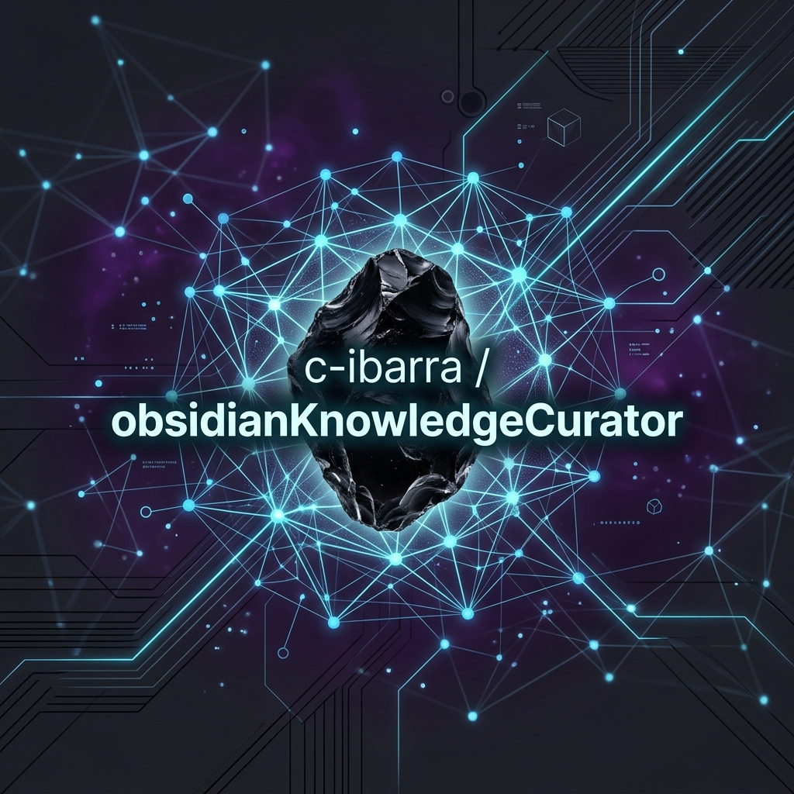
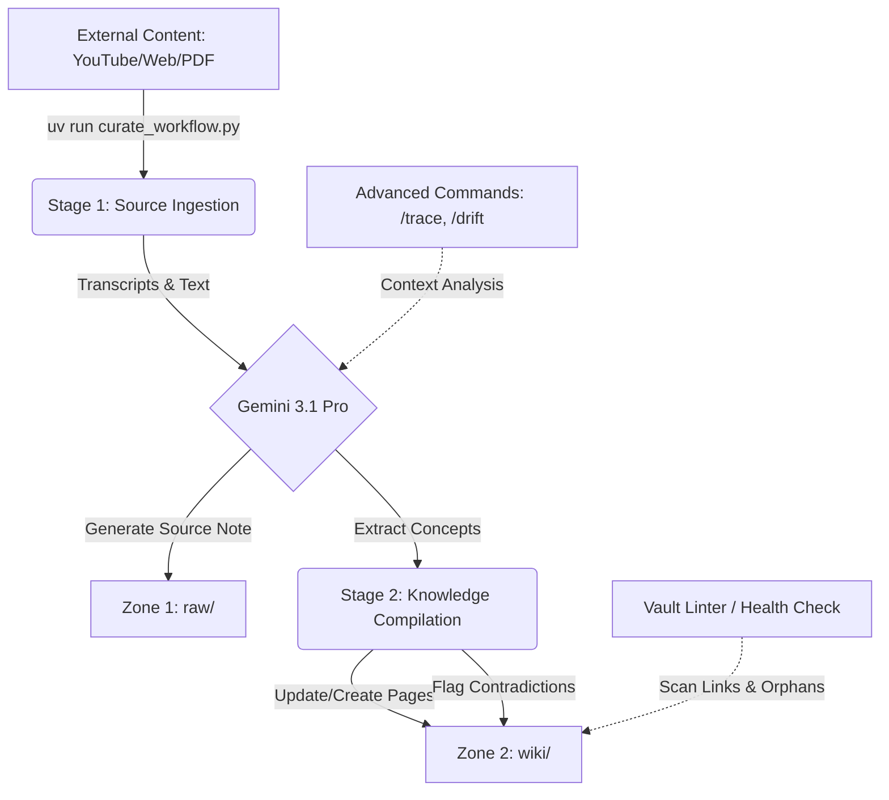

# Obsidian Knowledge Curator — Antigravity 2.0

  

An autonomous, agentic knowledge compiler designed to maintain and synthesize a "Second Brain" within an Obsidian Vault. Built natively with the **Google Antigravity SDK** and **Gemini 3.1 Pro**, this system automates the ingestion of technical articles, YouTube videos, and research papers, seamlessly weaving them into a highly structured, living knowledge graph.

---

## 📖 Table of Contents
- [Project Overview](#project-overview)
- [Problem Statement](#problem-statement)
- [System Architecture](#system-architecture)
- [The "Zone" Knowledge Architecture](#the-zone-knowledge-architecture)
- [End-to-End Workflow](#end-to-end-workflow)
- [AI & Agent Components](#ai--agent-components)
- [Context & Memory Management](#context--memory-management)
- [Security & Sandboxing](#security--sandboxing)
- [Technology Stack](#technology-stack)
- [Future Improvements & Lessons Learned](#future-improvements--lessons-learned)

---

## 🎯 Project Overview

This project serves as an advanced implementation of the **LLM Wiki Paradigm** (inspired by Andrej Karpathy's concept of LLMs as knowledge compilers rather than simple chatbots). 

Instead of treating the AI as a search engine over documents (like traditional RAG), the **Obsidian Knowledge Curator** acts as an active maintainer of a local filesystem database. It reads raw inputs, extracts core concepts, updates existing Wiki pages, flags contradictions, and builds a chronological trace of evolving ideas.

## 🧠 Problem Statement

**The Engineering Challenge:** 
Knowledge workers and AI Engineers consume vast amounts of technical content (papers, documentation, videos). Traditional PKM (Personal Knowledge Management) systems rely on manual synthesis, while modern LLM chatbots (chat-with-PDF) fail to compound knowledge over time because they lack persistent state and cross-document reasoning.

**The Solution:** 
A headless automation pipeline that ingests content, parses transcripts, and utilizes a large-context model (Gemini 3.1 Pro) to actively rewrite, link, and maintain a local Obsidian Vault graph, separating raw sources from synthesized concepts.

---

## 🏗 System Architecture

The project eschews heavy cloud abstractions in favor of a fast, local, agentic tooling approach.

### Why Antigravity SDK & Gemini? (Architectural Trade-offs)
* **Alternative Considered:** LangChain or LlamaIndex with a vector database (RAG).
* **Chosen Solution:** Antigravity SDK with Gemini 3.1 Pro using raw Python APIs.
* **Rationale:** I optimized for cost-efficiency and leveraging cutting-edge context windows. Gemini's massive 2M+ token context window allowed me to bypass the complexity, latency, and semantic loss of RAG chunking. By feeding entire vault subsections directly into the prompt, the agent performs superior qualitative synthesis. Furthermore, avoiding heavy abstractions like LangChain reduced execution overhead and gave me precise, deterministic control over the agent's file system I/O.

---

## 🗂 The "Zone" Knowledge Architecture

Before settling on this design, I considered a traditional flat-folder PKM structure. However, mixing raw notes and AI synthesis led to "context rot" and made programmatic updates dangerous. 

The vault is now strictly divided into three zones:

| Zone | Purpose | Agent Permissions |
|---|---|---|
| **`raw/`** | Immutable sources (Video transcripts, Web clippings). | **Append-Only**. The agent saves summaries here but never modifies historical sources. |
| **`wiki/`** | Synthesized concepts and entities. | **Read-Write**. Fully maintained by the LLM. The agent creates pages, injects wikilinks, and merges updates. |
| **`dev/`** | Architecture Decision Records (ADRs) and project files. | **Collaborative**. The agent acts as a co-pilot but requires explicit human approval to modify. |
| **`dswok/`** | Protected personal core. | **Strictly Blocked**. The agent cannot read or write to this directory. |

---

## 🔄 End-to-End Workflow

### 1. Multi-Stage Ingestion Pipeline (`curate_workflow.py`)
1. **Extraction:** Automates `yt-dlp` and `youtube-transcript-api` to pull and clean VTT transcripts.
2. **Raw Generation:** Prompts Gemini to generate a highly structured markdown summary (Key Takeaways, Flashcards, Glossary) and saves it to the `raw/` zone.
3. **Concept Compilation:** A secondary agentic pass reads the new raw note, identifies 3-7 core technical concepts, and either creates new `.md` files in the `wiki/` zone or appends the new insights to existing pages.

### 2. Advanced Vault Reasoning (`knowledge_commands.py`)
Because the knowledge is structured, the agent can perform deep-vault operations:
- `/trace`: Reconstructs the chronological evolution of an idea across the vault.
- `/emerge`: Scans recent notes to find implicit conclusions or recurring patterns the user hasn't explicitly documented.
- `/drift`: Compares stated intentions in older notes with actual recorded behavior in recent notes.

### 3. Continuous Integration / Health Checks (`vault_linter.py`)
A custom Python linter that runs against the vault to ensure graph integrity:
- Validates all `[[wikilinks]]` against existing files.
- Detects isolated "orphan" notes.
- Scans for the `> [!contradiction]` callout, which the agent injects when new sources conflict with existing wiki knowledge.

---

## 🔒 Security & Sandboxing

Allowing an autonomous agent to perform filesystem I/O requires deliberate constraints. While the system operates entirely locally for maximum privacy, the following security model is enforced:

1. **Path Containment:** The agent's `write_to_file` and `obsidian-cli` execution contexts are strictly jailed to the `obsidianKnowledgeCurator` workspace and the designated Vault path. 
2. **Directory Blacklists:** Critical directories (like `dswok/` and `~/.gemini`) are hardcoded as protected, preventing the agent from modifying system configurations or core personal data.
3. **Execution Safety:** The automation avoids fragile bash scripting (`cat`, `sed`) in favor of deterministic Python file handlers and AST-level modifications, significantly reducing the surface area for Prompt Injections hidden inside scraped web articles.

---

## 🧠 Context & Memory Management

**The Challenge:** Feeding hundreds of notes into an LLM can easily exceed token limits or dilute the model's attention mechanism.

**The Solution:** 
Instead of naive context dumping, the system implements **Targeted Context Gathering**. When executing complex reasoning commands (like `/emerge`), the Python orchestrator pre-filters the Vault, capping the payload at ~150 relevant files and trimming non-essential metadata. This ensures the prompt remains highly concentrated, allowing Gemini 3.1 Pro to maintain high recall accuracy without incurring unnecessary token costs.

---

## 🛠 Technology Stack

| Category | Technology | Purpose |
|---|---|---|
| **Core AI** | Gemini 3.1 Pro | Primary reasoning, text generation, and knowledge compilation engine. |
| **Agent Framework** | Google Antigravity SDK | Tool calling, orchestration, and agentic workflows. |
| **Backend / Scripting**| Python 3.11+, `uv` | High-speed, deterministic local execution environment. |
| **Knowledge Base** | Obsidian | Markdown-based graphical interface and local filesystem database. |
| **Scraping** | `yt-dlp`, `youtube-transcript-api` | Headless multimedia transcript extraction. |

---

## 🚀 Future Improvements & Lessons Learned

**Lessons Learned:**
1. **Tooling Specificity Matters:** Giving an LLM generic bash access is dangerous and error-prone. Building highly specific, scoped tools (like the Python-based vault linter) yielded exponentially more reliable results than asking the agent to "use grep to find broken links."
2. **Context vs. RAG:** Relying on Gemini's massive context window for local qualitative analysis proved superior to managing a complex local Vector DB, especially for a single-user knowledge graph where the entire corpus fits in memory.

**Roadmap:**
- Implement an automated cron-job to run the `/emerge` command weekly and append the findings to a "Weekly Review" note.
- Expand the `knowledge_commands.py` to support semantic vector search as a fallback when exact keyword matching fails.
- Package the automation scripts into a standalone CLI tool for easier distribution.
